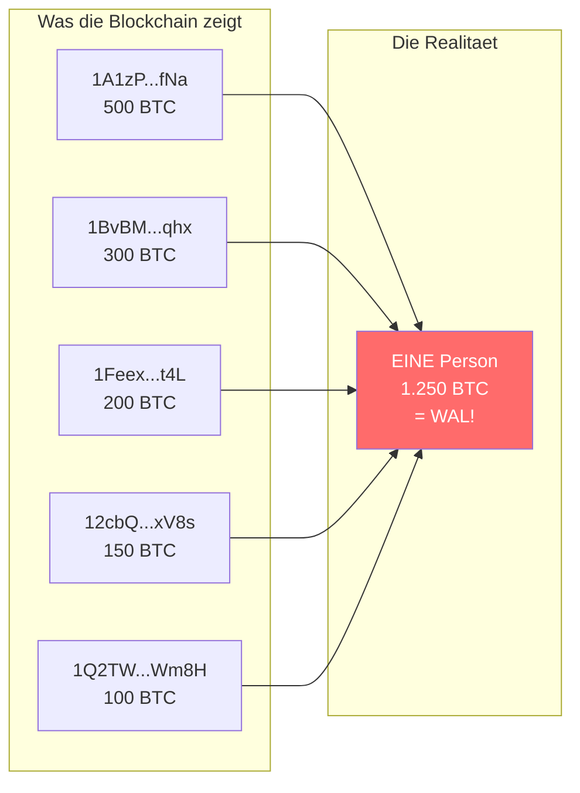
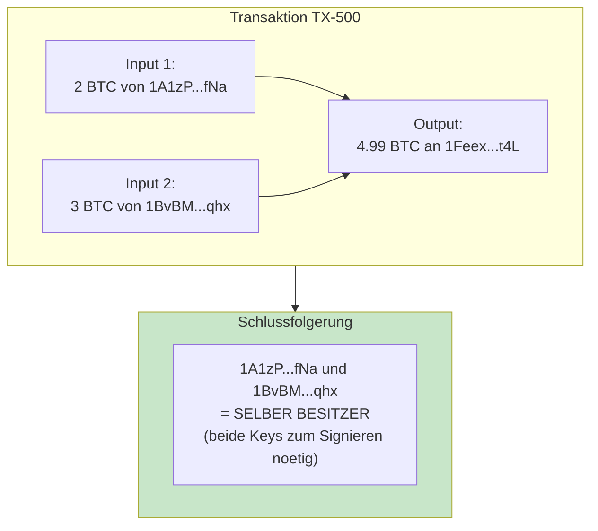
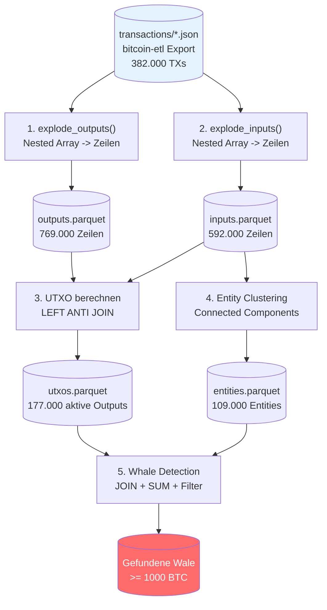

# Bitcoin Whale Intelligence

> Versteckte Bitcoin-Wale durch Entity Clustering aufspueren

---

## Das Problem: Versteckte Wale

Ein Bitcoin-Wal mit **5.000 BTC** kann sein Vermoegen auf hunderte Adressen verteilen. Auf der Blockchain sieht das aus wie viele kleine Besitzer:



**Ohne Analyse:** 5 harmlose Adressen mit 100-500 BTC
**Mit Analyse:** 1 Wal mit 1.250 BTC!

---

## Die Loesung: Common Input Ownership

Wenn jemand eine Transaktion erstellt die **mehrere Adressen als Inputs** kombiniert, muss er alle Private Keys besitzen. Diese Adressen gehoeren also derselben Person!



---

## Pipeline-Uebersicht



---

## Quick Start

```bash
git clone https://github.com/RomanRnlt/bitcoin-whale-intelligence.git
cd bitcoin-whale-intelligence
python3 -m venv venv && source venv/bin/activate
pip install -r requirements.txt
./start_project.sh
```

Siehe [docs/setup.md](docs/setup.md) fuer Details.

---

## Projekt-Status

| Status | Komponente | Beschreibung |
|--------|------------|--------------|
| Fertig | Daten laden | bitcoin-etl JSON einlesen |
| Fertig | explode_outputs() | Nested -> Flach |
| Fertig | explode_inputs() | Nested -> Flach |
| Fertig | UTXO-Set | Aktive Guthaben berechnen |
| Fertig | Entity Clustering | Connected Components |
| Geplant | Whale Detection | Balance pro Entity |

---

## Dokumentation

| Dokument | Inhalt |
|----------|--------|
| [docs/architecture.md](docs/architecture.md) | **Pipeline mit Mermaid-Diagrammen und Erklaerungen** |
| [docs/setup.md](docs/setup.md) | Installation und Konfiguration |

---

## Tech Stack

| Technologie | Zweck |
|-------------|-------|
| **Apache Spark** | Verteilte Verarbeitung (900M+ Transaktionen) |
| **GraphFrames** | Connected Components Algorithmus |
| **Parquet** | Spalten-Storage (70-90% Kompression) |
| **bitcoin-etl** | Bitcoin-Datenexport (JSON Format) |

---

## Projektstruktur

```
bitcoin-whale-intelligence/
├── notebooks/
│   └── 01_entity_clustering.ipynb   # Hauptanalyse
├── src/
│   └── etl.py                       # Spark ETL-Funktionen
├── data/                            # Generierte Parquet-Dateien
├── docs/
│   ├── architecture.md              # Pipeline-Dokumentation
│   └── setup.md                     # Setup-Anleitung
└── start_project.sh                 # Startskript
```

---

## Metriken (H1/2011 Testdaten)

| Schritt | Input | Output | Info |
|---------|-------|--------|------|
| Transaktionen | - | 382.000 | Rohdaten |
| Outputs | 382k TXs | 769.000 | explode() |
| Inputs | 382k TXs | 592.000 | explode() |
| **UTXOs** | 769k | **177.000** | 77% spent |
| **Entities** | 148k Adressen | **109.000** | 26% gruppiert |

**26% Reduktion:** Ueber ein Viertel aller Adressen gehoeren zu Mehrfach-Besitzern und konnten gruppiert werden!

---

*Master-Projekt - Advanced Data Engineering - Wirtschaftsinformatik*
