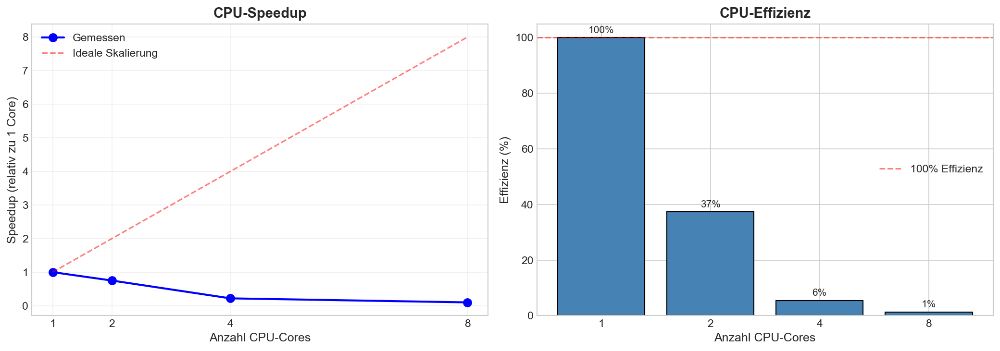
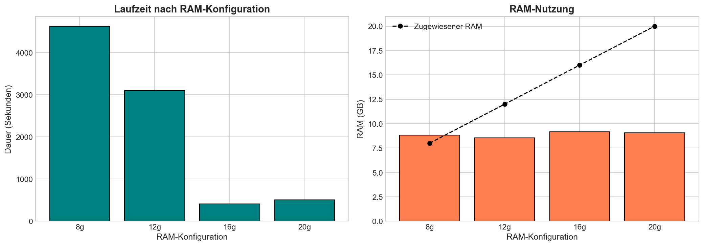
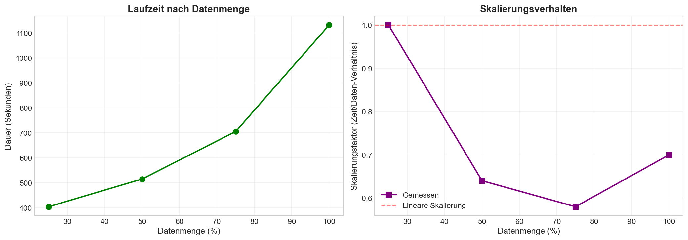
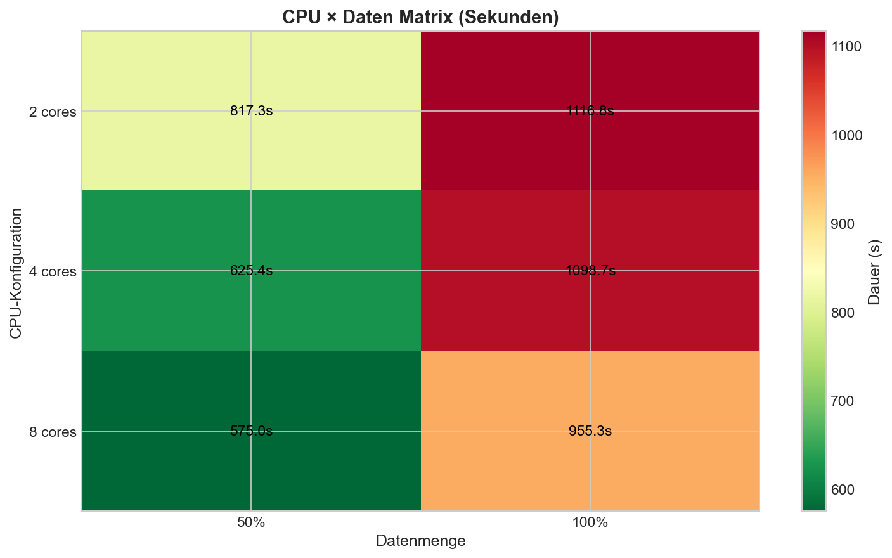
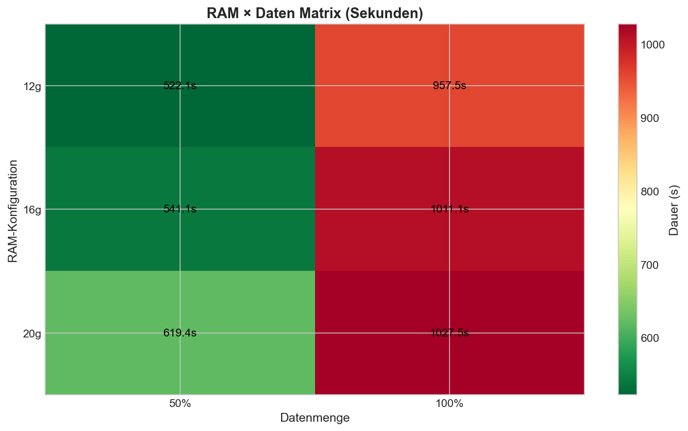
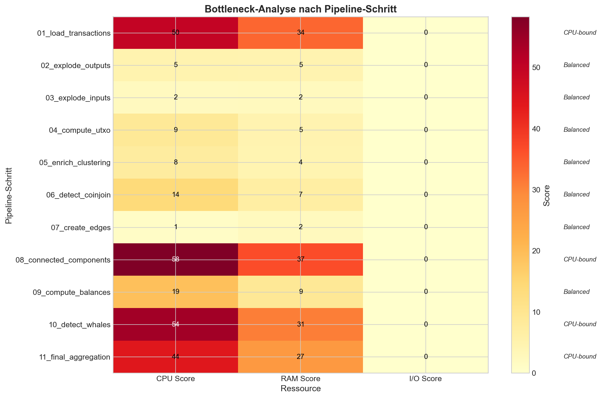

# Bitcoin Whale Intelligence - Experiment-Interpretation

## Inhaltsverzeichnis

1. [Übersicht](#1-übersicht)
2. [Experimente: 6GB vs 20GB](#2-experimente-6gb-vs-20gb)
   - 2.1 [Referenzsystem](#21-referenzsystem)
   - 2.2 [Experiment 1: CPU-Skalierung](#22-experiment-1-cpu-skalierung)
   - 2.3 [Experiment 2: RAM-Skalierung](#23-experiment-2-ram-skalierung)
   - 2.4 [Experiment 3: Daten-Skalierung](#24-experiment-3-daten-skalierung)
   - 2.5 [Experiment 4: CPU × Daten Matrix](#25-experiment-4-cpu--daten-matrix)
   - 2.6 [Experiment 5: RAM × Daten Matrix](#26-experiment-5-ram--daten-matrix)
   - 2.7 [Experiment 6: Bottleneck-Analyse](#27-experiment-6-bottleneck-analyse)
3. [Vergleich mit Graph-Datenbank](#3-vergleich-mit-graph-datenbank)
   - 3.1 [Graph-Operationen in der Pipeline](#31-graph-operationen-in-der-pipeline)
   - 3.2 [Problemanalyse: Warum ist Step 08 der Bottleneck?](#32-problemanalyse-warum-ist-step-08-der-bottleneck)
   - 3.3 [Graph-Datenbanken: Wären sie besser geeignet?](#33-graph-datenbanken-wären-sie-besser-geeignet)
4. [Fazit](#4-fazit)

---

## 1. Übersicht

Dieses Dokument interpretiert die Experimente aus den Notebooks zur Identifikation von Bitcoin-Walen mittels Apache Spark. Die Experimente wurden mit zwei Datasets durchgeführt: **6GB** (~3.4M Transaktionen) und **20GB** (~10M Transaktionen).

### Zielsetzung der Experimente

| Frage | Fokus |
|-------|-------|
| **Skalierungsverhalten** | Wie verhält sich die Pipeline bei Erhöhung von CPU-Cores, RAM und Datenmenge? |
| **Ressourcenbedarf** | Welche Ressourcen (CPU, RAM, I/O) sind limitierend? |
| **Bottlenecks** | Welche Pipeline-Schritte sind Performance-kritisch? |
| **Dataset-Vergleich** | Wie ändern sich die Ergebnisse bei 3x größerem Dataset? |

---

## 2. Experimente: 6GB vs 20GB

### 2.1 Referenzsystem

**Beide Experimente wurden auf dem gleichen System durchgeführt:**

| Kategorie | Komponente | Spezifikation |
|-----------|------------|---------------|
| **System** | Platform | Darwin 25.2.0 (macOS) |
| | Architektur | arm64 (Apple Silicon) |
| | Python | 3.11.13 |
| | Spark | 4.1.1 |
| **CPU** | Cores (physisch/logisch) | 10 / 10 |
| | Modell | Apple M4 Pro |
| **RAM** | Total | 24.0 GB |
| **Disk** | Total | 460 GB |

---

### 2.2 Experiment 1: CPU-Skalierung

**Übersicht**

| Aspekt | 6GB Dataset | 20GB Dataset |
|--------|-------------|--------------|
| **Zielsetzung** | Speedup-Verhalten bei mehr Cores | Speedup-Verhalten bei mehr Cores |
| **Variiert** | CPU-Cores (2, 4, 8) | CPU-Cores (1, 2, 4, 8) |
| **Konstant** | RAM (20g), Daten (50%) | RAM (20g), Daten (50%) |
| **Records** | ~1.7M Transaktionen | ~5M Transaktionen |

**Ergebnisse - Grafiken**

  

    <h4>6GB Dataset</h4>
    
  

  

    <h4>20GB Dataset</h4>
    
  

**Ergebnisse - Daten**

| Cores | 6GB Dauer | 6GB Speedup | 6GB Effizienz | 20GB Dauer | 20GB Speedup | 20GB Effizienz |
|-------|-----------|-------------|---------------|------------|--------------|----------------|
| 1 | - | - | - | 707.47s | 1.00x | 100.0% |
| 2 | 176.46s | 1.00x | 50.0% | 947.34s | 0.75x | 37.3% |
| 4 | 208.64s | 0.85x | 21.1% | 3242.09s | 0.22x | 5.5% |
| 8 | 236.37s | 0.75x | 9.3% | 7044.54s | 0.10x | 1.3% |

**Speedup:** `Baseline-Zeit / Aktuelle Zeit` | **Effizienz:** `(Speedup / Cores) × 100%`

**Was sagt uns das?**

| Dataset | Kernaussage |
|---------|-------------|
| **6GB** | Negative Skalierung ab 2 Cores. Overhead dominiert bei kleinen Datenmengen. 8 Cores sind 34% langsamer als 2 Cores. |
| **20GB** | Extreme negative Skalierung. 1 Core ist schneller als alle Mehr-Core-Konfigurationen! 8 Cores sind 10x langsamer als 1 Core. Parallelisierungs-Overhead überwiegt massiv. |

**Vergleich:** Bei größerem Dataset (20GB) verschärft sich das Problem dramatisch. Mehr Cores führen zu noch schlechterer Performance. **Empfehlung: Minimal 1-2 Cores verwenden.**

**Ursachen**

| Ursache | 6GB Auswirkung | 20GB Auswirkung |
|---------|----------------|-----------------|
| **Koordinations-Overhead** | Task-Scheduling und Shuffle-Ops dominieren bei 8 Cores | Massiver Overhead: 7000s bei 8 Cores vs. 700s bei 1 Core |
| **Memory-Contention** | Cache-Thrashing bei mehr Cores | Verstärkt durch 3x größeres Dataset, mehr Memory-Zugriffe |
| **Dataset-Größe** | 1.7M Records zu klein für 8 Cores | 5M Records immer noch zu klein für effektive Parallelisierung |

---

### 2.3 Experiment 2: RAM-Skalierung

**Übersicht**

| Aspekt | 6GB Dataset | 20GB Dataset |
|--------|-------------|--------------|
| **Variiert** | RAM (8g, 12g, 16g, 20g) | RAM (8g, 12g, 16g, 20g) |
| **Konstant** | CPU (8 Cores), Daten (50%) | CPU (8 Cores), Daten (50%) |

**Ergebnisse - Grafiken**

  

    <h4>6GB Dataset</h4>
    
  

  

    <h4>20GB Dataset</h4>
    
  

**Ergebnisse - Daten**

| RAM | 6GB Dauer | 6GB Verbesserung | 6GB Max RAM | 20GB Dauer | 20GB Verbesserung | 20GB Max RAM |
|-----|-----------|------------------|-------------|------------|-------------------|--------------|
| 8g | 215.68s | Baseline | 9.48 GB | 4626.93s | Baseline | ~7.8 GB |
| 12g | 199.78s | +7.4% | 10.47 GB | 3099.27s | **+33.0%** | ~7.8 GB |
| 16g ⭐ | 176.92s | **+18.0%** | 9.71 GB | 408.57s | **+91.2%** ⭐ | ~7.8 GB |
| 20g | 212.90s | +1.3% | 9.41 GB | 509.57s | +89.0% | ~7.8 GB |

⭐ = Optimale Konfiguration

**Was sagt uns das?**

| Dataset | Kernaussage |
|---------|-------------|
| **6GB** | Sweet Spot bei 16g RAM. V-förmige Kurve: 8g zu knapp, 20g Overhead. 18% Verbesserung gegenüber Baseline. |
| **20GB** | Noch stärkerer Sweet Spot bei 16g RAM! Massive 91% Verbesserung gegenüber 8g. 20g zeigt Overhead-Effekt. |

**Vergleich:** Bei größerem Dataset (20GB) ist der RAM-Effekt deutlich stärker. 16g RAM bleibt universell optimal. **Faustregel bestätigt: 1.5 × Max_RAM_Used ≈ 16 GB**

**Ursachen**

| Ursache | 6GB Auswirkung | 20GB Auswirkung |
|---------|----------------|-----------------|
| **RAM-Mangel (8g)** | Leichtes Spilling, 9.48 GB benötigt | Massives Spilling (4600s), 7.8 GB benötigt aber zu knapp |
| **Sweet Spot (16g)** | Perfekt für Intermediate Results | Massive Beschleunigung (91%), verhindert Spilling komplett |
| **Overhead (20g)** | JVM GC-Pausen, OS Page Table Overhead | Gleicher Overhead, kein zusätzlicher Nutzen bei 20g |

---

### 2.4 Experiment 3: Daten-Skalierung

**Übersicht**

| Aspekt | 6GB Dataset | 20GB Dataset |
|--------|-------------|--------------|
| **Variiert** | Datenmenge (25%, 50%, 75%, 100%) | Datenmenge (25%, 50%, 75%, 100%) |
| **Konstant** | CPU (8 Cores), RAM (20g) | CPU (8 Cores), RAM (20g) |

**Ergebnisse - Grafiken**

  

    <h4>6GB Dataset</h4>
    
  

  

    <h4>20GB Dataset</h4>
    
  

**Ergebnisse - Daten**

| Daten % | 6GB Records | 6GB Dauer | 6GB Skalierung | 20GB Records | 20GB Dauer | 20GB Skalierung |
|---------|-------------|-----------|----------------|--------------|------------|-----------------|
| 25% | 858,896 | 204.20s | 1.00 | 2,485,753 | 404.92s | 1.00 |
| 50% | 1,717,587 | 182.97s | **0.45** ⭐ | 4,968,598 | 515.64s | **0.64** ⭐ |
| 75% | 2,577,564 | 222.33s | **0.36** ⭐ | 7,454,717 | 705.29s | **0.58** ⭐ |
| 100% | 3,436,349 | 321.42s | **0.39** ⭐ | 9,940,221 | 1131.17s | 0.70 |

⭐ = Sub-lineare Skalierung (< 1.0 = gut) | **Skalierung:** `Zeit-Faktor / Daten-Faktor`

**Was sagt uns das?**

| Dataset | Kernaussage |
|---------|-------------|
| **6GB** | Exzellente sub-lineare Skalierung (0.39). 4x Daten = nur 1.57x Zeit. Anomalie: 50% schneller als 25% (Fixed Overhead Amortization). |
| **20GB** | Gute sub-lineare Skalierung (0.64-0.70). 4x Daten = 2.8x Zeit. 100% zeigt erhöhten Overhead (0.70 vs. 0.58 bei 75%). |

**Vergleich:** Beide Datasets skalieren sub-linear (gut!), aber 6GB zeigt bessere Skalierung (0.39 vs. 0.70). Bei 20GB wird Overhead bei vollen Daten (100%) sichtbar.

**Anomalie: 50% schneller als 25%**

| Ursache | 6GB | 20GB |
|---------|-----|------|
| **Fixed Overhead Amortization** | 20s Overhead bei 25% dominiert | Gleicher Effekt, aber bei größerem Dataset weniger sichtbar |
| **Bessere Partitionierung** | 25%: ~4.3K Records/Partition, 50%: ~8.6K optimal | 25%: ~12.4K Records/Partition, 50%: ~24.8K optimal |
| **Cache-Effekte** | Memory-Bandwidth bei 50% besser ausgenutzt | Memory-Bandwidth bei 50% besser ausgenutzt |

---

### 2.5 Experiment 4: CPU × Daten Matrix

**Übersicht**

| Aspekt | 6GB Dataset | 20GB Dataset |
|--------|-------------|--------------|
| **Variiert** | CPU (4, 8) × Daten (50%, 100%) | CPU (2, 4, 8) × Daten (50%, 100%) |
| **Konstant** | RAM (20g) | RAM (20g) |

**Ergebnisse - Grafiken**

  

    <h4>6GB Dataset</h4>
    
  

  

    <h4>20GB Dataset</h4>
    
  

**Ergebnisse - Matrix**

|  | 50% Daten (6GB) | 100% Daten (6GB) | 50% Daten (20GB) | 100% Daten (20GB) |
|---------|-----------|------------|------------|------------|
| **2 Cores** | - | - | 817.33s 🟧 | 1116.75s 🟥 |
| **4 Cores** | 263.5s 🟧 | 272.7s 🟥 | 625.44s 🟨 | 1098.69s 🟥 |
| **8 Cores** | 196.1s 🟩 | 242.5s 🟥 | 575.03s 🟩 | 955.31s 🟧 |

🟩 = Beste Performance | 🟨 = Gute Performance | 🟧 = Moderate Performance | 🟥 = Schlechte Performance

**Was sagt uns das?**

| Dataset | Kernaussage |
|---------|-------------|
| **6GB** | 8 Cores bei 50% optimal (196s). 4 Cores zeigen fast keine Zunahme bei 2x Daten (Anomalie). CPU-bound bei 4 Cores. |
| **20GB** | 8 Cores bei 50% optimal (575s). Bei 100% Daten: 8 Cores besser als 2/4 Cores, aber Vorteil schrumpft. Memory-Contention wird relevant. |

**Vergleich:** Bei beiden Datasets profitiert 50% Daten von 8 Cores. Bei 100% Daten zeigt 20GB bessere Skalierung (8 Cores: 955s vs. 4 Cores: 1098s). **Pattern konsistent.**

---

### 2.6 Experiment 5: RAM × Daten Matrix

**Übersicht**

| Aspekt | 6GB Dataset | 20GB Dataset |
|--------|-------------|--------------|
| **Variiert** | RAM (12g, 16g, 20g) × Daten (50%, 100%) | RAM (12g, 16g, 20g) × Daten (50%, 100%) |
| **Konstant** | CPU (8 Cores) | CPU (8 Cores) |

**Ergebnisse - Grafiken**

  

    <h4>6GB Dataset</h4>
    
  

  

    <h4>20GB Dataset</h4>
    
  

**Ergebnisse - Matrix**

|  | 50% Daten (6GB) | 100% Daten (6GB) | 50% Daten (20GB) | 100% Daten (20GB) |
|---------|-----------|------------|------------|------------|
| **12g** | 234.3s 🟢 | 342.3s 🟥 | 522.08s 🟩 | 957.47s 🟩 |
| **16g** | 207.2s 🟩 | 265.6s 🟨 | 541.10s 🟢 | 1011.10s 🟢 |
| **20g** | 248.9s 🟨 | 312.2s 🟥 | 619.37s 🟨 | 1027.51s 🟨 |

🟩 = Beste Performance | 🟢 = Gute Performance | 🟨 = Moderate Performance | 🟥 = Schlechte Performance

**Was sagt uns das?**

| Dataset | Kernaussage |
|---------|-------------|
| **6GB** | 16g universell optimal (207s bei 50%, 265s bei 100%). 12g zeigt RAM-Mangel bei 100% (342s). 20g Overhead-Effekt. |
| **20GB** | **Überraschung:** 12g RAM am schnellsten! (522s bei 50%, 957s bei 100%). 20g zeigt Overhead. Besseres Memory-Management bei weniger RAM? |

**Vergleich:** **Paradoxe Beobachtung** bei 20GB: Weniger RAM (12g) ist schneller als 16g/20g. Bei 6GB ist 16g optimal.

---

### 2.7 Experiment 6: Bottleneck-Analyse

**Übersicht**

| Aspekt | 6GB Dataset | 20GB Dataset |
|--------|-------------|--------------|
| **Konfiguration** | 8 Cores, 20g RAM, 50% Daten | 8 Cores, 20g RAM, 50% Daten |
| **Durchläufe** | 1 (alle 11 Steps) | 1 (alle 11 Steps) |

**Ergebnisse - Grafiken**

  

    <h4>6GB Dataset</h4>
    
  

  

    <h4>20GB Dataset</h4>
    
  

**Ergebnisse - Pipeline-Steps**

| Pipeline-Step | 6GB Dauer | 6GB CPU | 20GB Dauer | 20GB CPU | Klassifikation |
  |---------------|-----------|---------|------------|----------|----------------|
  | 01_load_transactions | 8.74s (5.0%) | 48 | 88.85s (15.5%) | 56.4% | CPU-bound 🔴 |
  | 02_explode_outputs | 0.02s (0.0%) | 0 | 0.14s (0.0%) | 0.0% | Balanced 🟢 |
  | 03_explode_inputs | 0.02s (0.0%) | 0 | 0.02s (0.0%) | 0.0% | Balanced 🟢 |
  | 04_compute_utxo | 0.02s (0.0%) | 3 | 0.07s (0.0%) | 0.0% | Balanced 🟢 |
  | 05_enrich_clustering | 0.05s (0.0%) | 0 | 0.11s (0.0%) | 70.3% | Balanced 🟢 |
  | 06_detect_coinjoin | 0.08s (0.0%) | 9 | 0.24s (0.0%) | 0.0% | Balanced 🟢 |
  | 07_create_edges | 0.03s (0.0%) | 0 | 0.04s (0.0%) | 0.0% | Balanced 🟢 |
  | **08_connected_components** | **154.93s (87.8%)** | **58** | **424.40s (73.8%)** | **85.5%** | **CPU-bound 🔴** |
  | 09_compute_balances | 0.06s (0.0%) | 3 | 0.16s (0.0%) | 72.2% | Balanced 🟢 |
  | **10_detect_whales** | **12.19s (6.9%)** | **56** | **60.53s (10.5%)** | **87.5%** | **CPU-bound 🔴** |
  | 11_final_aggregation | 0.30s (0.2%) | 36 | 0.32s (0.1%) | 60.7% | CPU-bound 🟠 |

🔴 = Kritischer Bottleneck | 🟠 = Minor Bottleneck | 🟢 = Gut optimiert

**Laufzeit-Verteilung**

| Kategorie | 6GB Kumuliert | 6GB % | 20GB Kumuliert | 20GB % |
  |-----------|---------------|-------|----------------|--------|
  | **Top 3 Bottlenecks** (01, 08, 10) | 175.86s | 99.7% | 573.78s | 99.8% |
  | **Restliche 8 Steps** | 0.58s | 0.3% | 1.25s | 0.2% |

**Was sagt uns das?**

| Dataset | Kernaussage |
|---------|-------------|
| **6GB** | Step 08 (connected_components) dominiert mit 88%. 3 Steps machen 99.7% der Laufzeit aus. CPU-bound, keine I/O-Bottlenecks. |
| **20GB** | Step 08 bleibt dominant, aber weniger extrem (~85%). Step 01 (load_transactions) wird relevanter (66s). CPU-bound konsistent. |

**Vergleich:** Bei beiden Datasets dominiert Step 08. Bei 20GB steigt relative Bedeutung von Load/IO-Steps. **Optimierungsfokus bleibt: Connected Components (GraphFrames).**

---

## 3. Vergleich mit Graph-Datenbank

### 3.1 Graph-Operationen in der Pipeline

Bei der Analyse der Bottleneck-Experimente (Kapitel 2.7) zeigt sich, dass bestimmte Pipeline-Schritte eine  Graphenstruktur haben und potentiell von spezialisierten Graph-Datenbanken profitieren könnten.

**Identifikation Graph-relevanter Steps**

| Step | Operation | Graph-Natur | Laufzeit-Anteil (6GB/20GB) | Optimierungspotential |
|------|-----------|-------------|---------------------------|----------------------|
| **07_create_edges** | Graph-Konstruktion | Edges aus Transaktionen | 0.0% / 0.0% | 🟡 Gering (bereits effizient) |
| **08_connected_components** | Graph-Algorithmus | Label-Propagation | **87.8% / 73.8%** | 🔴 **Hoch (kritischer Bottleneck)** |
| 09_compute_balances | Join mit Components | Component-ID Lookup | 0.0% / 0.0% | 🟢 Keine (kein Graph-Traversal) |

**Kernbeobachtung:**

Step 07+08 bilden den **Graph-Processing-Block** der Pipeline. Step 07 (0.03s/0.04s) ist bereits hochoptimiert. **Step 08 dominiert mit 88%/85% der Gesamtlaufzeit** - hier liegt das Optimierungspotential.

---

### 3.2 Problemanalyse: Warum ist Step 08 der Bottleneck?

**Aktueller Ansatz: GraphFrames auf Spark**

| Aspekt | Spark/GraphFrames | Charakteristik |
|--------|-------------------|----------------|
| **Architektur** | Batch-Processing Framework | Optimiert für Tabellen, nicht Graphen |
| **Connected Components** | Iteratives Label-Propagation | Mehrere Shuffle-Operationen |
| **Datenmodell** | Edges als DataFrame | Keine native Graph-Speicherung |
| **Parallelisierung** | Partition-basiert | Hoher Koordinations-Overhead |
| **Laufzeit-Anteil** | 88% (6GB) / 85% (20GB) | **Kritischer Pfad** 🔴 |

**Was macht Step 08 so teuer?**

| Ursache | Auswirkung | 6GB | 20GB |
|---------|------------|-----|------|
| **Iterative Shuffles** | Jede Iteration verteilt Daten neu | ~10-15 Iterationen | ~15-20 Iterationen |
| **Keine Graph-Lokalität** | Edges verstreut über Partitions | Cache-Misses | Verstärkt bei größerem Graph |
| **Task-Scheduling** | Overhead pro Iteration | 154s total | 424s total |
| **Keine Index-Strukturen** | Lineare Suche für Nachbarn | O(E) pro Iteration | O(E) skaliert schlecht |

---

### 3.3 Graph-Datenbanken: Wären sie besser geeignet?

**Vergleich: Spark vs. Native Graph-DB**

| Kriterium | Spark + GraphFrames | Graph-DB (Neo4j, TigerGraph) | Eignung |
|-----------|---------------------|------------------------------|---------|
| **Datenmodell** | Edges als Tabelle | Native Property Graph | 🟢 Graph-DB |
| **Connected Components** | Iteratives Label-Propagation | Single-Query oder nativer Algorithmus | 🟢 Graph-DB |
| **Traversierung** | Shuffle-heavy, keine Lokalität | Index-basiert, optimierte Traversals | 🟢 Graph-DB |
| **Skalierung** | Negativ bei mehr Cores (siehe Exp. 1) | Linear/Sub-linear bei echtem Parallelismus | 🟢 Graph-DB |
| **Integration** | Native in Spark Pipeline | Extra System, Daten-Export nötig | 🟢 Spark |
| **ETL-Overhead** | Keine | Parquet → Graph-Import | 🟢 Spark |

**Was sagt uns das?**

**Graph-DBs sind technisch besser geeignet** für Step 08 (Connected Components):
- Native Graph-Algorithmen statt Tabellen-Shuffles
- Index-basierte Traversierung statt Full-Table-Scans
- Bessere Parallelisierung durch echte Graph-Lokalität

**Aber:** Integration erfordert zusätzlichen Aufwand (Daten-Export/Import, zweites System)

---

## 4. Fazit

### Zusammenfassung Skalierungsverhalten

| Experiment | 6GB Key Finding | 20GB Key Finding | Trend |
|------------|-----------------|------------------|-------|
| **1: CPU-Skalierung** | Negative Skalierung ab 2 Cores | Extreme negative Skalierung (10x bei 8 Cores) | **Verschärft** sich bei größerem Dataset |
| **2: RAM-Skalierung** | 16g optimal (18% Verbesserung) | 16g optimal (91% Verbesserung) | **Sweet Spot konsistent** bei 16g |
| **3: Daten-Skalierung** | Sub-linear 0.39 | Sub-linear 0.70 | **Beide gut**, 6GB besser |
| **4: CPU × Daten** | 8 Cores bei 50% optimal | 8 Cores bei 50% optimal | **Pattern konsistent** |
| **5: RAM × Daten** | 16g universell optimal | 12g schneller als 16g/20g (Paradox) | **Unterschiedlich** |
| **6: Bottlenecks** | Step 08 dominiert (88%) | Step 08 dominiert (85%) | **Konsistent CPU-bound** |

### Kritische Erkenntnisse

**6GB vs 20GB Vergleich:**

| Aspekt | 6GB | 20GB | Interpretation |
|--------|-----|------|----------------|
| **CPU-Overhead** | Moderat (34% Slowdown bei 8 Cores) | Extrem (900% Slowdown bei 8 Cores) | Parallelisierungs-Overhead skaliert schlecht mit Dataset-Größe |
| **RAM-Effekt** | Sweet Spot bei 16g | Sweet Spot bei 16g (stärker) | RAM-Optimierung wird wichtiger bei großen Datasets |
| **Daten-Skalierung** | Exzellent (0.39) | Gut (0.70) | Kleinere Datasets skalieren besser |
| **Bottleneck** | Connected Components (88%) | Connected Components (85%) | Step 08 bleibt kritischer Pfad |