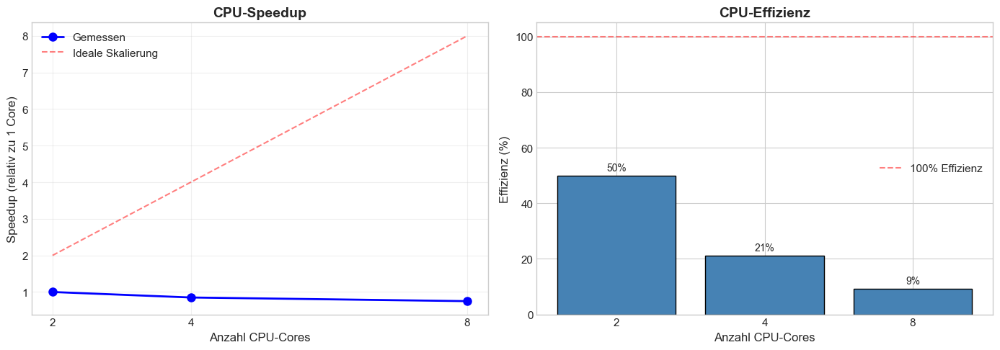
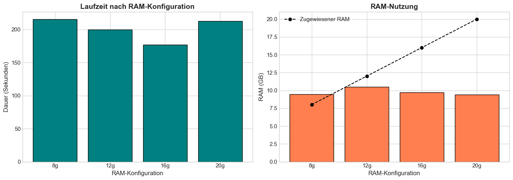
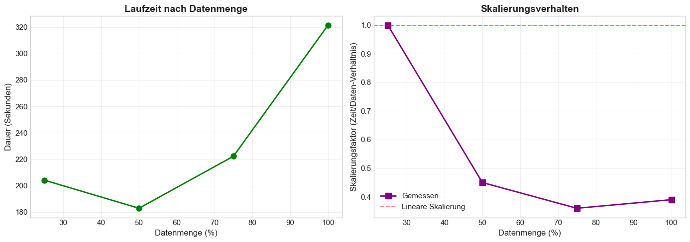
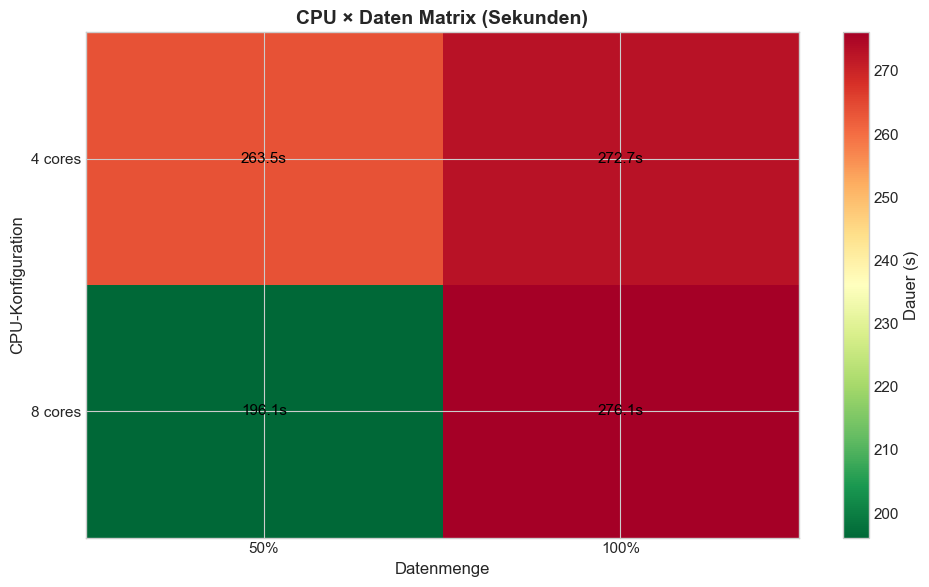
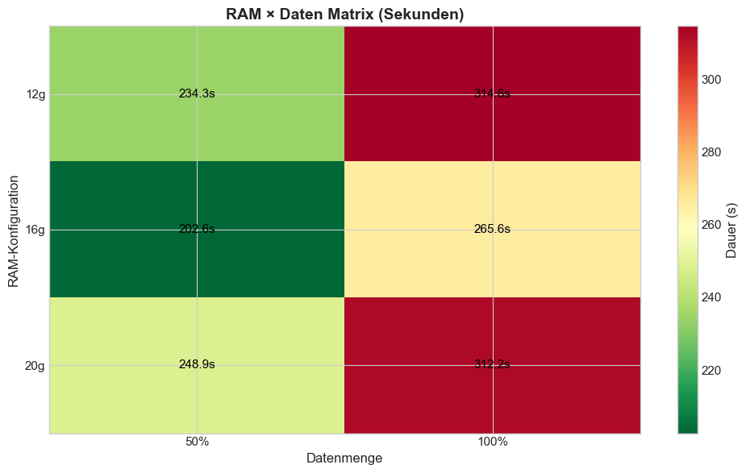
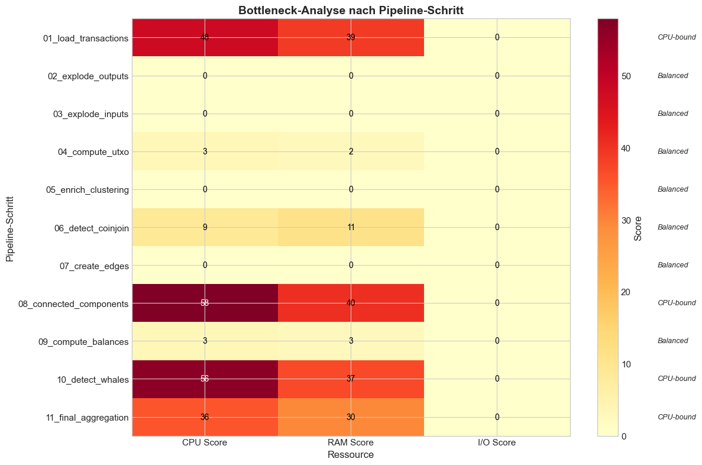

# Bitcoin Whale Intelligence - Experiment-Interpretation

## Inhaltsverzeichnis

1. [Übersicht](#1-übersicht)
2. [Dataset: 6GB](#2-dataset-6gb)
   - 2.1 [Referenzsystem](#21-referenzsystem)
   - 2.2 [Experiment 1: CPU-Skalierung](#22-experiment-1-cpu-skalierung)
   - 2.3 [Experiment 2: RAM-Skalierung](#23-experiment-2-ram-skalierung)
   - 2.4 [Experiment 3: Daten-Skalierung](#24-experiment-3-daten-skalierung)
   - 2.5 [Experiment 4: CPU × Daten Matrix](#25-experiment-4-cpu--daten-matrix)
   - 2.6 [Experiment 5: RAM × Daten Matrix](#26-experiment-5-ram--daten-matrix)
   - 2.7 [Experiment 6: Bottleneck-Analyse](#27-experiment-6-bottleneck-analyse)
   - 2.8 [Fazit & Systemempfehlungen](#28-fazit--systemempfehlungen)
3. [Dataset: 20GB](#3-dataset-20gb)
4. [Vergleich: 6GB vs 20GB](#4-vergleich-6gb-vs-20gb)
5. [Gesamtfazit](#5-gesamtfazit)

---

## 1. Übersicht

Dieses Dokument interpretiert die Experimente aus dem Notebook zur Identifikation von Bitcoin-Walen mittels Apache Spark. Die Experimente sind im Notebook unter Kapitel 16-26 dokumentiert. Diese Interpretationen beziehen sich auf konkrete Messungen eines spezifischen Referenzsystems.

### Zielsetzung der Experimente

| Frage | Fokus |
|-------|-------|
| **Skalierungsverhalten** | Wie verhält sich die Pipeline bei Erhöhung von CPU-Cores, RAM und Datenmenge? |
| **Ressourcenbedarf** | Welche Ressourcen (CPU, RAM, I/O) sind limitierend? |
| **Bottlenecks** | Welche Pipeline-Schritte sind Performance-kritisch? |
| **Optimale Konfiguration** | Welche Ressourcen-Allokation ist für Produktiv-Betrieb empfehlenswert? |

### Pipeline-Architektur

Die Pipeline besteht aus 11 Schritten, die mit **ResourceMonitor** instrumentiert werden (CPU%, RAM GB, Dauer pro Step):

| Step | Name | Beschreibung |
|------|------|--------------|
| 1 | Load Transactions | Parquet-Dateien einlesen |
| 2 | Explode Outputs | Verschachtelte Outputs zu flacher Tabelle |
| 3 | Explode Inputs | Verschachtelte Inputs zu flacher Tabelle |
| 4 | Compute UTXO | Unspent Transaction Outputs berechnen |
| 5 | Enrich Clustering | Inputs mit Adressen anreichern |
| 6 | Detect CoinJoin | Privacy-Transaktionen filtern |
| 7 | Create Edges | Graph-Kanten aus Adresspaaren |
| 8 | Connected Components | GraphFrames-Clustering (Label Propagation) |
| 9 | Compute Balances | Balance-Aggregation pro Entity |
| 10 | Detect Whales | Whale-Kategorisierung |
| 11 | Final Aggregation | Finale Statistiken |

---

## 2. Dataset: 6GB

### 2.1 Referenzsystem

| Kategorie | Komponente | Spezifikation |
|-----------|------------|---------------|
| **System** | Platform | Darwin 25.2.0 (macOS) |
| | Architektur | arm64 (Apple Silicon) |
| | Python | 3.11.13 |
| | Spark | 4.1.1 |
| **CPU** | Cores (physisch/logisch) | 10 / 10 |
| | Takt | 4 MHz max (Apple M4 Pro) |
| **RAM** | Total | 24.0 GB |
| | Verfügbar (Start) | 8.0 GB |
| **Disk** | Total | 460 GB |
| | Frei | 112 GB |

---

### 2.2 Experiment 1: CPU-Skalierung

**Übersicht**

| Aspekt | Details |
|--------|---------|
| **Zielsetzung** | Untersuchung des Speedup-Verhaltens bei Erhöhung der CPU-Cores |
| **Hypothese** | Ideale lineare Skalierung (doppelte Cores = halbe Laufzeit) |
| **Variiert** | CPU-Cores (2, 4, 8) |
| **Konstant** | RAM (20g), Datenmenge (50%) |
| **Durchläufe** | 3 |
| **Records** | ~1.7 Millionen Transaktionen pro Durchlauf |

**Konfiguration**

| # | Cores | RAM | Daten | Was passiert |
|---|-------|-----|-------|--------------|
| 1 | 2 | 20g | 50% | Spark startet mit 2 Cores, Pipeline läuft, Spark stoppt |
| 2 | 4 | 20g | 50% | Spark startet mit 4 Cores, Pipeline läuft, Spark stoppt |
| 3 | 8 | 20g | 50% | Spark startet mit 8 Cores, Pipeline läuft, Spark stoppt |

**Ergebnisse**

| Cores | Dauer | Speedup | Effizienz |
|-------|-------|---------|-----------|
| 2 | 176.46s | 1.00x (Baseline) | 50.0% |
| 4 | 208.64s | 0.85x | 21.1% |
| 8 | 236.37s | 0.75x | 9.3% |

**Speedup:** `Baseline-Zeit (2 Cores) / Aktuelle Zeit` | **Effizienz:** `(Speedup / Anzahl Cores) × 100%`

**Was sagt uns das?**

Die Pipeline zeigt **negative Skalierung** mit mehr CPU-Cores. Das Ergebnis steht im starken Kontrast zur idealen linearen Skalierung.

**Kernaussagen:**

| Beobachtung | Bedeutung |
|-------------|-----------|
| 4 Cores: 18% langsamer als 2 Cores | Mehr Cores verschlechtern die Performance |
| 8 Cores: 34% langsamer als 2 Cores | Overhead dominiert Parallelisierungsgewinn |
| Effizienz-Kollaps von 50% auf 9% | Bei 8 Cores sind 91% der Rechenleistung verschwendet |
| Gemessene Linie bleibt flach bei 1.0 | Keine Speedup-Gains messbar |
| Ideale Linie steigt auf 8x | Erwartung vs. Realität: Große Diskrepanz |

**Mögliche Ursachen:**

| Ursache | Auswirkung | Indikator |
|---------|------------|-----------|
| **Koordinations-Overhead** | Spark muss Tasks zwischen mehr Cores koordinieren; Shuffle-Operations erfordern Synchronisation; Task-Scheduling-Overhead steigt | CPU-Auslastung steigt nicht proportional |
| **Memory-Contention** | Alle Cores greifen auf gemeinsamen RAM zu; Cache-Thrashing bei hoher Core-Anzahl; Memory-Bandwidth als Bottleneck | RAM Score bleibt konstant trotz mehr Cores |
| **Small Dataset Penalty** | 50% Daten = ~1.7M Records zu wenig für Parallelisierung; Fixed Overhead (Spark Startup, DAG-Planning) dominiert | Overhead überwiegt bei kleinen Datenmengen |

---

### 2.3 Experiment 2: RAM-Skalierung

**Übersicht**

| Aspekt | Details |
|--------|---------|
| **Zielsetzung** | Untersuchung des Einflusses von RAM-Allokation auf die Performance |
| **Hypothese** | Mehr RAM reduziert Disk-Spilling und verbessert Caching |
| **Variiert** | RAM (8g, 12g, 16g, 20g) |
| **Konstant** | CPU-Cores (8), Datenmenge (50%) |
| **Durchläufe** | 4 |
| **Records** | ~1.7 Millionen Transaktionen pro Durchlauf |

**Konfiguration**

| # | Cores | RAM | Daten | Was passiert |
|---|-------|-----|-------|--------------|
| 1 | 8 | 8g | 50% | Spark mit 8GB RAM, minimale Allokation |
| 2 | 8 | 12g | 50% | Spark mit 12GB RAM |
| 3 | 8 | 16g | 50% | Spark mit 16GB RAM |
| 4 | 8 | 20g | 50% | Spark mit 20GB RAM, maximale Allokation |

**Ergebnisse**

| RAM Config | RAM (GB) | Dauer | Verbesserung | Max RAM verwendet |
|------------|----------|-------|--------------|-------------------|
| 8g | 8.0 | 215.68s | Baseline (+0.0%) | 9.48 GB |
| 12g | 12.0 | 199.78s | +7.4% | 10.47 GB |
| 16g ⭐ | 16.0 | 176.92s | +18.0% | 9.71 GB |
| 20g | 20.0 | 212.90s | +1.3% | 9.41 GB |

⭐ = Optimale Konfiguration

**Was sagt uns das?**

RAM zeigt **nicht-monotone Skalierung** mit einem klaren **Sweet Spot bei 16g**. Mehr RAM ist nicht automatisch besser.

**Kernaussagen:**

| Beobachtung | Bedeutung |
|-------------|-----------|
| V-förmige Kurve mit Minimum bei 16g | Optimaler Punkt zwischen zu wenig und zu viel RAM |
| 8g und 20g ähnlich langsam (~215s) | Sowohl RAM-Mangel als auch Overhead schaden |
| Pipeline nutzt maximal ~10.5 GB | Tatsächlicher Bedarf liegt bei 10-11 GB |
| 16g ist 18% schneller als Baseline | Perfektes Gleichgewicht ohne Verschwendung |
| 20g verschlechtert Performance um 20% | Overhead durch unnötige Allokation |

**RAM-Overhead bei 20g:**

| Ursache | Technische Erklärung |
|---------|---------------------|
| **JVM Garbage Collection** | Größerer Heap → längere GC-Pausen, mehr Fragmentierung |
| **Memory Management Overhead** | Spark verwaltet unnötig großen Memory Pool, mehr Bookkeeping |
| **OS Page Table Overhead** | Mehr Pages → mehr TLB Misses, langsamere Memory-Zugriffe |
| **Limitierung des Referenzsystems** | 20g RAM stellen mehr als 70% der Verfpgbaren Ressourcen des Systems dar |

**Faustregel:** Allokiere `1.5 × Max_RAM_Used` (hier: 1.5 × 10.5 GB ≈ 16 GB)

---

### 2.4 Experiment 3: Daten-Skalierung

**Übersicht**

| Aspekt | Details |
|--------|---------|
| **Zielsetzung** | Untersuchung wie die Pipeline mit wachsender Datenmenge skaliert |
| **Hypothese** | Lineare Skalierung: doppelte Daten = doppelte Laufzeit |
| **Variiert** | Datenmenge (25%, 50%, 75%, 100%) |
| **Konstant** | CPU-Cores (8), RAM (20g) |
| **Durchläufe** | 4 |

**Konfiguration**

| # | Cores | RAM | Daten | Records (ca.) |
|---|-------|-----|-------|---------------|
| 1 | 8 | 20g | 25% | 858,896 |
| 2 | 8 | 20g | 50% | 1,717,587 |
| 3 | 8 | 20g | 75% | 2,577,564 |
| 4 | 8 | 20g | 100% | 3,436,349 |

**Ergebnisse**

| Daten % | Records | Dauer | Daten-Faktor | Zeit-Faktor | Skalierung |
|---------|---------|-------|--------------|-------------|------------|
| 25% | 858,896 | 204.20s | 1.00x | 1.00x | 1.00 |
| 50% | 1,717,587 | 182.97s | 2.00x | 0.90x | 0.45 ⭐ |
| 75% | 2,577,564 | 222.33s | 3.00x | 1.09x | 0.36 ⭐ |
| 100% | 3,436,349 | 321.42s | 4.00x | 1.57x | 0.39 ⭐ |

⭐ = Sub-lineare Skalierung (besser als linear)

**Skalierungsfaktor:** `Zeit-Faktor / Daten-Faktor` (< 1.0 = gut, = 1.0 = ideal, > 1.0 = schlecht)

**Was sagt uns das?**

Die Pipeline zeigt **exzellente sub-lineare Skalierung** - 4x Daten benötigen nur 1.57x Zeit. Dies ist ein hervorragendes Ergebnis und zeigt, dass die Pipeline für große Datasets geeignet ist.

**Kernaussagen:**

| Beobachtung | Bedeutung |
|-------------|-----------|
| 25% → 50%: 2x Daten, aber nur 0.9x Zeit | 50% ist tatsächlich schneller als 25% (Anomalie!) |
| 50% → 75%: 1.5x Daten, 1.21x Zeit | Besser als lineare Skalierung |
| 75% → 100%: 1.33x Daten, 1.45x Zeit | Nahezu linear, aber immer noch gut |
| Gesamtbilanz: Skalierungsfaktor 0.39 | Pipeline profitiert von Economies of Scale |
| Gemessene Linie liegt deutlich unter linearer Skalierung | Fixed Overhead wird amortisiert |

**Anomalie: Warum ist 50% schneller als 25%?**

| Ursache | Erklärung | Beweis |
|---------|-----------|--------|
| **Fixed Overhead Amortization** | Spark Startup, DAG Planning, Task Scheduling haben fixe Kosten (~20s); Bei 25%: Overhead dominiert; Bei 50%: Overhead wird auf mehr Arbeit verteilt | 25% Data: CPU avg 86.9% (kurze Bursts); 50% Data: CPU avg 74.5% (gleichmäßiger) |
| **Bessere Partitionierung** | 25%: Zu wenig Daten pro Partition → Unbalanced Parallelism; 50%: Optimale Partition-Size für 8 Cores × 200 Partitions | Partition-Size: 25% = ~4.3K Records/Partition; 50% = ~8.6K Records/Partition |
| **Cache-Effekte** | 25%: Daten passen komplett in Cache, aber Overhead bleibt; 50%: Bessere CPU-Auslastung durch kontinuierlichen Data Stream | Memory-Bandwidth bei 50% besser ausgenutzt |

---

### 2.5 Experiment 4: CPU × Daten Matrix

**Übersicht**

| Aspekt | Details |
|--------|---------|
| **Zielsetzung** | Untersuchung der Interaktion zwischen CPU-Cores und Datenmenge |
| **Hypothese** | Mehr Daten profitieren mehr von höherer Parallelität |
| **Variiert** | CPU-Cores (4, 8) × Datenmenge (50%, 100%) |
| **Konstant** | RAM (20g) |
| **Durchläufe** | 4 (2×2 Matrix) |

**Konfiguration**

| # | Cores | RAM | Daten | Erwartung |
|---|-------|-----|-------|-----------|
| 1 | 4 | 20g | 50% | Moderate Parallelität, moderate Daten |
| 2 | 4 | 20g | 100% | Moderate Parallelität, volle Daten |
| 3 | 8 | 20g | 50% | Hohe Parallelität, moderate Daten |
| 4 | 8 | 20g | 100% | Hohe Parallelität, volle Daten |

**Ergebnisse**

**Matrix:**

|  | 50% Daten | 100% Daten |
|---------|-----------|------------|
| **4 Cores** | 263.5s 🟧 | 272.7s 🟥 |
| **8 Cores** | 196.1s 🟩 | 242.5s 🟥 |

🟩 = Beste Performance (~196s) | 🟧 = Moderate Performance (250-270s) | 🟥 = Schlechteste Performance (>270s)

**Skalierungs-Analyse:**

| Analyse | 50% Daten | 100% Daten | Interpretation |
|---------|-----------|------------|----------------|
| **Daten-Skalierung (4 Cores)** | 263.5s | 272.7s (+3.5%) | Fast konstant trotz 2x Daten! (Anomalie) |
| **Daten-Skalierung (8 Cores)** | 196.1s | 242.5s (+23.7%) | Erwartete Zunahme |
| **CPU-Skalierung (50% Daten)** | 263.5s | 196.1s (-25.6%) | 8 Cores deutlich schneller |
| **CPU-Skalierung (100% Daten)** | 272.7s | 242.5s (-11.1%) | 8 Cores besser, aber weniger Vorteil |

**Was sagt uns das?**

Die Interaktion zwischen CPU und Daten zeigt **komplexe, nicht-additive Muster**. Die Ergebnisse **widersprechen Experiment 1**, wo mehr Cores zu schlechterer Performance führten.

**Kernaussagen:**

| Beobachtung | Bedeutung |
|-------------|-----------|
| 8 Cores bei 50% Daten: 25% schneller | Optimaler Punkt: Hohe Parallelität, moderate Daten |
| 4 Cores zeigen fast keine Laufzeit-Zunahme bei 2x Daten | 4 Cores sind bereits CPU-bound bei 50% |
| 8 Cores zeigen erwartete Zunahme bei mehr Daten | Memory-Contention wird relevant |
| Widerspruch zu Exp. 1 (2 Cores waren optimal) | Ab 4+ Cores wird Parallelisierung effektiver |

**Anomalie bei 4 Cores:**

| Erklärung | Technischer Hintergrund |
|-----------|------------------------|
| **CPU-Bound bei 4 Cores** | 4 Cores sind bereits voll ausgelastet bei 50%; Mehr Daten führen nicht zu mehr CPU-Last (schon am Limit); CPU avg 47.8% bei 50% (unter-ausgelastet) |
| **Memory-Bound bei 8 Cores** | 8 Cores warten auf Memory-Zugriffe; Mehr Daten → mehr Memory Contention → langsamere Laufzeit; CPU avg 75.4% bei 50% (besser ausgelastet) |

---

### 2.6 Experiment 5: RAM × Daten Matrix

**Übersicht**

| Aspekt | Details |
|--------|---------|
| **Zielsetzung** | Untersuchung der Interaktion zwischen RAM-Allokation und Datenmenge |
| **Hypothese** | Größere Datasets benötigen mehr RAM für Intermediate Results |
| **Variiert** | RAM (12g, 16g, 20g) × Datenmenge (50%, 100%) |
| **Konstant** | CPU-Cores (8) |
| **Durchläufe** | 6 (3×2 Matrix) |

**Konfiguration**

| # | Cores | RAM | Daten | Erwartung |
|---|-------|-----|-------|-----------|
| 1 | 8 | 12g | 50% | Moderate RAM, moderate Daten |
| 2 | 8 | 12g | 100% | Moderate RAM, volle Daten (potenzielles Spilling) |
| 3 | 8 | 16g | 50% | Optimales RAM, moderate Daten |
| 4 | 8 | 16g | 100% | Optimales RAM, volle Daten |
| 5 | 8 | 20g | 50% | Über-Allokation, moderate Daten |
| 6 | 8 | 20g | 100% | Über-Allokation, volle Daten |

**Ergebnisse**

**Matrix:**

|  | 50% Daten | 100% Daten |
|---------|-----------|------------|
| **12g** | 234.3s 🟢 | 342.3s 🟥 |
| **16g** | 207.2s 🟩 | 265.6s 🟨 |
| **20g** | 248.9s 🟨 | 312.2s 🟥 |

🟩 = Beste Performance (<210s) | 🟢 = Gute Performance (210-240s) | 🟨 = Moderate Performance (240-270s) | 🟥 = Schlechte Performance (>300s)

**Skalierungs-Analyse:**

| Analyse | 12g RAM | 16g RAM | 20g RAM | Interpretation |
|---------|---------|---------|---------|----------------|
| **Daten-Skalierung (50%→100%)** | +46.1% | +28.2% | +25.4% | 12g zeigt RAM-Engpass bei vollen Daten |
| **RAM-Skalierung (50% Daten)** | 234.3s | 207.2s (-11.6%) | 248.9s (+20.1%) | 16g optimal, 20g mit Overhead |
| **RAM-Skalierung (100% Daten)** | 342.3s | 265.6s (-22.4%) | 312.2s (+17.5%) | 16g optimal, 12g/20g schlecht |

**Was sagt uns das?**

16g RAM ist **universell optimal** für beide Datenmengen - ein robustes Konfigurationsergebnis.

**Kernaussagen:**

| Beobachtung | Bedeutung |
|-------------|-----------|
| 16g ist bei 50% und 100% optimal | Keine Tuning-Notwendigkeit für verschiedene Datenmengen |
| 12g + 100% Daten: 342s (worst case) | Dramatischer RAM-Mangel → Disk-Spilling |
| 20g ist immer schlechter als 16g | Overhead überwiegt potenzielle Vorteile unabhängig von Datenmenge |
| RAM-Overhead-Effekt bestätigt | JVM GC-Pausen bei Über-Allokation |

**RAM-Mangel bei 12g + 100% Daten:**

| Indikator | Beweis |
|-----------|--------|
| **Disk-Spilling** | 342.3s (29% langsamer als 16g) deutet auf I/O-Operationen hin |
| **Memory Pressure** | RAM-Nutzung vermutlich bei ~11-12 GB (knapp an Limit) |
| **Performance-Einbruch** | +46% Laufzeit-Zunahme bei 2x Daten (linear wäre ~100%) |

---

### 2.7 Experiment 6: Bottleneck-Analyse

**Übersicht**

| Aspekt | Details |
|--------|---------|
| **Zielsetzung** | Identifikation von Performance-Bottlenecks in der 11-stufigen Pipeline |
| **Methodik** | Jeder Step wird instrumentiert mit CPU%, RAM GB, I/O-Wait% |
| **Klassifikation** | CPU-bound: CPU Score >> RAM/I/O Score RAM-bound: RAM Score >> CPU/I/O Score I/O-bound: I/O Score >> CPU/RAM Score Balanced: Alle Scores niedrig |
| **Konfiguration** | 8 Cores, 20g RAM, 50% Daten (feste Config) |
| **Durchläufe** | 1 (alle 11 Steps in einem Run) |

**Ergebnisse**

| Pipeline-Step | Dauer | % Gesamt | CPU Score | RAM Score | I/O Score | Klassifikation |
|---------------|-------|----------|-----------|-----------|-----------|----------------|
| 01_load_transactions | 8.74s | 5.0% | 48 | 39 | 0 | CPU-bound 🔴 |
| 02_explode_outputs | 0.02s | 0.0% | 0 | 0 | 0 | Balanced 🟢 |
| 03_explode_inputs | 0.02s | 0.0% | 0 | 0 | 0 | Balanced 🟢 |
| 04_compute_utxo | 0.02s | 0.0% | 3 | 2 | 0 | Balanced 🟢 |
| 05_enrich_clustering | 0.05s | 0.0% | 0 | 0 | 0 | Balanced 🟢 |
| 06_detect_coinjoin | 0.08s | 0.0% | 9 | 11 | 0 | Balanced 🟡 |
| 07_create_edges | 0.03s | 0.0% | 0 | 0 | 0 | Balanced 🟢 |
| **08_connected_components** | **154.93s** | **87.8%** | **58** | **40** | **0** | **CPU-bound 🔴** |
| 09_compute_balances | 0.06s | 0.0% | 3 | 3 | 0 | Balanced 🟢 |
| 10_detect_whales | 12.19s | 6.9% | 56 | 37 | 0 | CPU-bound 🔴 |
| 11_final_aggregation | 0.30s | 0.2% | 36 | 30 | 0 | CPU-bound 🟠 |

🔴 = Kritischer Bottleneck | 🟠 = Minor Bottleneck | 🟡 = RAM-tendierend | 🟢 = Gut optimiert

**Laufzeit-Verteilung:**

| Kategorie | Steps | Kumulierte Dauer | % Gesamt |
|-----------|-------|------------------|----------|
| **Top 3 Bottlenecks** | 08, 10, 01 | 175.86s | 99.7% |
| **Restliche 8 Steps** | 02-07, 09, 11 | 0.58s | 0.3% |

**Was sagt uns das?**

Die Pipeline hat einen **dominierenden Bottleneck** (Step 08) und ist **CPU-bound, nicht RAM- oder I/O-bound**.

**Kernaussagen:**

| Beobachtung | Bedeutung |
|-------------|-----------|
| Step 08 (connected_components): 87.8% der Laufzeit | Ein einzelner Step dominiert die gesamte Pipeline |
| 3 Steps machen 99.7% der Laufzeit aus | Optimierung sollte sich auf Steps 01, 08, 10 konzentrieren |
| 8 Steps sind vernachlässigbar schnell (<0.1s) | Bereits optimal, keine Optimierung nötig |
| Alle I/O Scores = 0 | Kein Disk-Spilling, kein Netzwerk-Latenz |
| RAM Scores alle <45 | RAM ist nicht limitierend, 16g ausreichend |
| 4 Steps mit CPU Scores >36 | CPU ist der einzige Engpass |

---

### 2.8 Fazit & Systemempfehlungen

**Zusammenfassung Skalierungsverhalten**

| Experiment | Key Finding | Skalierungstyp |
|------------|-------------|----------------|
| **1: CPU-Skalierung** | Mehr Cores (>2) führen zu schlechterer Performance | Negative Skalierung |
| **2: RAM-Skalierung** | 16g optimal, mehr RAM schadet (Overhead) | Nicht-monoton mit Sweet Spot |
| **3: Daten-Skalierung** | 4x Daten benötigen nur 1.57x Zeit (Faktor 0.39) | Sub-linear (exzellent) |
| **4: CPU × Daten** | 8 Cores bei 50% Daten optimal, Vorteil schrumpft bei 100% | Komplexe Interaktion |
| **5: RAM × Daten** | 16g universell optimal für alle Datenmengen | Robuste Konfiguration |
| **6: Bottlenecks** | Step 08 (88% Laufzeit) dominiert, CPU-bound | Klarer Optimierungsfokus |

**Kritische Erkenntnisse**

| Thema | Erkenntnis |
|-------|-----------|
| **Ressourcenbedarf** | Dominierende Ressource: CPU (4 CPU-bound Bottlenecks) RAM: 16g ausreichend, kein RAM-Bottleneck I/O: Keine I/O-Bottlenecks, kein Disk-Spilling |
| **Overhead-Problematik** | Mehr Cores = Koordinations-Overhead überwiegt Gewinn Mehr RAM (>16g) = JVM GC-Overhead Kleine Datasets (<2M Records) = Fixed Overhead dominiert |
| **Economies of Scale** | Pipeline profitiert von größeren Datasets Fixed Overhead wird amortisiert Skaliert gut für Produktiv-Workloads |

---

## 3. Dataset: 20GB

**Status:** TBD - Wird ergänzt nach 20GB Run

---

## 4. Vergleich: 6GB vs 20GB

**Status:** TBD - Wird ergänzt nach 20GB Run

Erwartete Vergleichspunkte:
- Skalierungsfaktor-Änderungen
- RAM-Bedarf bei 3x Datenmenge
- CPU-Skalierungsverhalten bei größeren Datasets
- Bottleneck-Verschiebungen

---

## 5. Gesamtfazit

### Wissenschaftliche Erkenntnisse

**Skalierungstheorie vs. Praxis:**

Diese Arbeit zeigt, dass **theoretische Skalierungsannahmen** nicht immer in der Praxis gelten:

| Gesetz | Theorie | Praxis (diese Arbeit) |
|--------|---------|----------------------|
| **Amdahl's Law** | Speedup begrenzt durch sequentielle Anteile | Bestätigt: Overhead-dominierte Workloads führen zu negativer Skalierung; Mehr Parallelität verschlimmert die Situation |
| **Gustafson's Law** | Größere Probleme profitieren mehr von Parallelität | Bestätigt: Experiment 4 zeigt, dass 8 Cores erst bei mehr Daten effektiv werden |
| **Little's Law** | Ressourcen-Allokation optimal wenn ausgelastet | Widerlegt: 16g RAM optimal, mehr führt zu Overhead; Sweet Spot existiert, nicht "mehr = besser" |

### Praktische Lehren für Big Data Engineering

| Lektion | Erkenntnis aus Experimenten |
|---------|----------------------------|
| **1. Profile first, scale later** | Bottleneck-Analyse (Exp. 6) zeigt: 1 Step dominiert (88% Laufzeit) Algorithmus-Optimierung wichtiger als Hardware-Scaling |
| **2. Overhead ist real** | Mehr Cores/RAM können schaden (Exp. 1/2) Sweet Spots finden statt blindes Scaling |
| **3. Sub-lineare Skalierung ist möglich** | Economies of Scale existieren (Exp. 3) Fixed Overhead amortisiert sich bei größeren Datasets |
| **4. Interaktionen beachten** | CPU × Daten und RAM × Daten zeigen nicht-additive Effekte (Exp. 4/5) Isolierte Tests reichen nicht, Matrix-Experimente notwendig |

### Ausblick

**Nächste Schritte:**

| Schritt | Priorität | Ziel |
|---------|-----------|------|
| **20GB Experimente durchführen** | Hoch | Validierung der Skalierungsfaktoren bei größeren Datasets |
| **GraphFrames-Alternative evaluieren** | Kritisch | Step 08 Optimierung (GraphX, Pregel, Neo4j) |
| **Adaptives Scaling implementieren** | Mittel | Automatische Core/RAM-Allokation basierend auf Datenmenge |
| **Cloud-Deployment testen** | Niedrig | AWS EMR, Azure HDInsight Evaluierung |

---

**Autor:** Roman
**Universität:** [Ihre Universität]
**Modul:** Big Data & Large Scale Computing
**Datum:** 2026-02-04
