# Bitcoin Whale Intelligence - Notebook Workflow

> Ubersicht uber die Analyse-Pipeline: Notebooks, Status und Datenfluss

---

## Gesamtubersicht der Pipeline

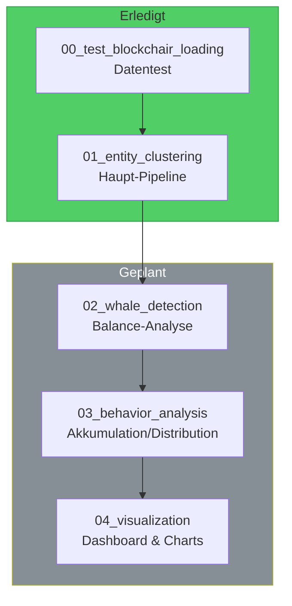

---

## Status-Ubersicht

| Notebook | Status | Beschreibung |
|----------|--------|--------------|
| `00_test_blockchair_loading` | Erledigt | Testen der Blockchair-Datenstruktur |
| `01_entity_clustering` | Erledigt | Komplette Pipeline bis Entity-Mapping |
| `02_whale_detection` | Geplant | Balance pro Entity berechnen |
| `03_behavior_analysis` | Geplant | Akkumulation vs. Distribution |
| `04_visualization` | Geplant | Charts und Dashboard |

---

## Notebook 01: Entity Clustering (Fertig)

### Workflow-Diagramm

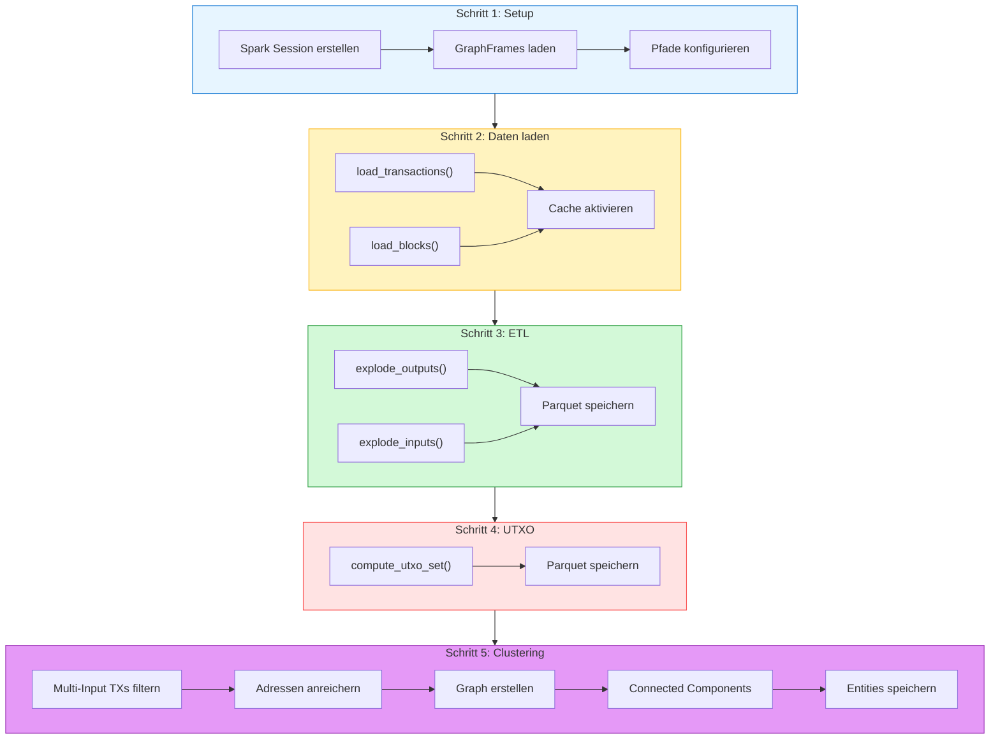

### Input/Output Ubersicht

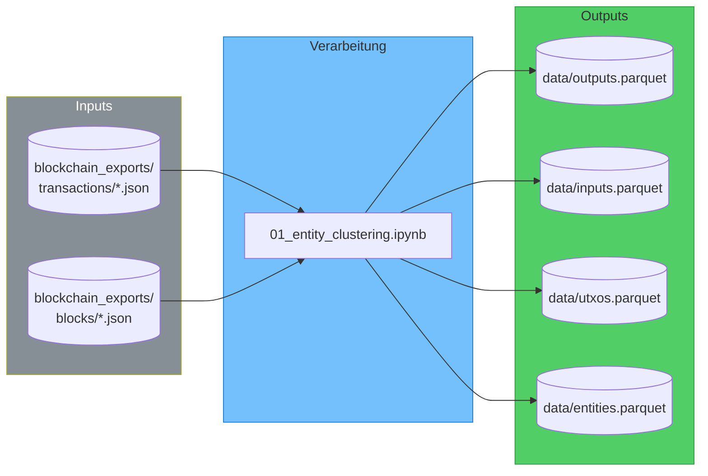

### Ergebnisse Notebook 01

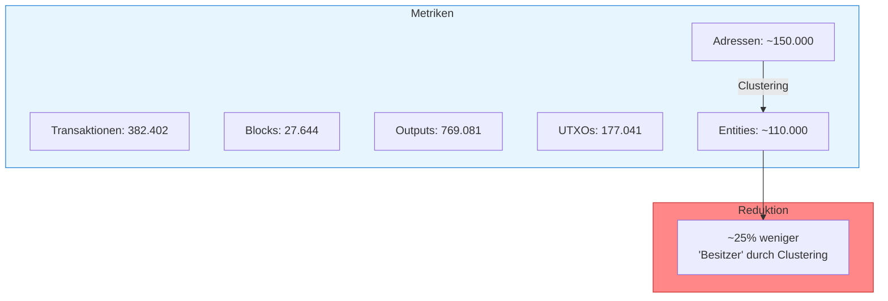

---

## Notebook 02: Whale Detection (Geplant)

### Geplanter Workflow

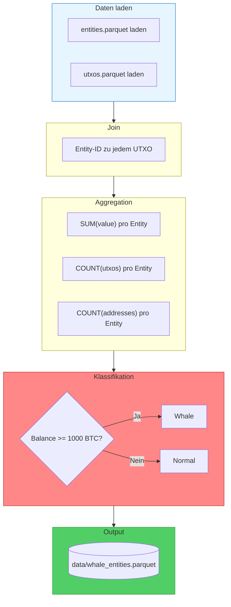

### Geplante Inputs/Outputs

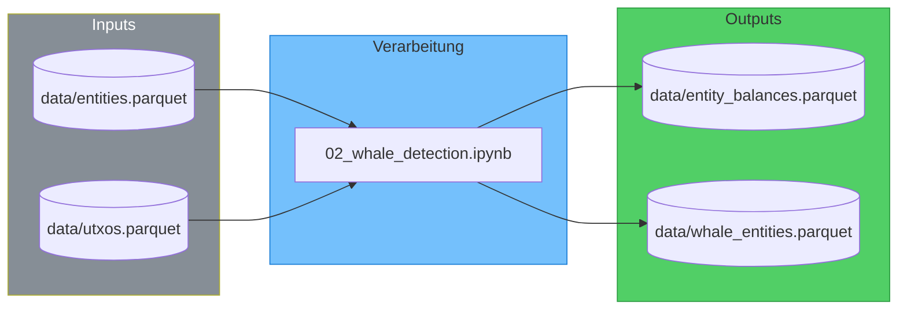

### Erwartete Analyse

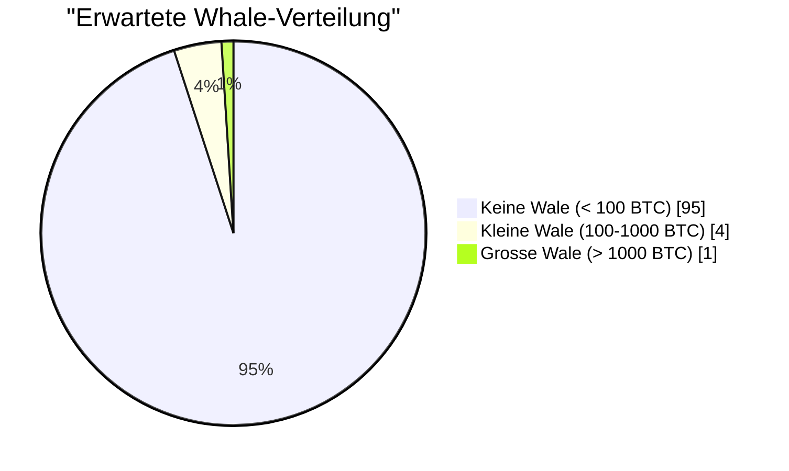

---

## Notebook 03: Verhaltensanalyse (Geplant)

### Geplanter Workflow

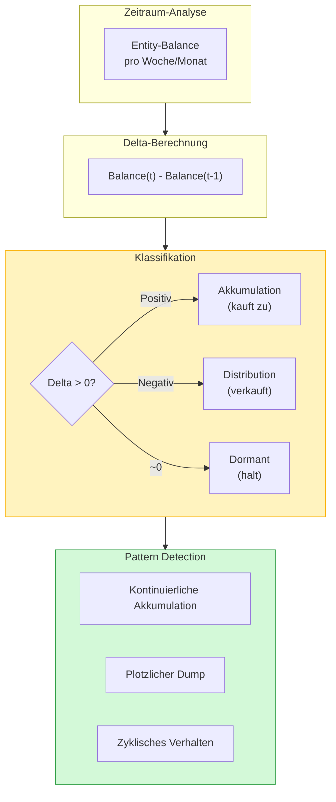

### Geplante Visualisierungen

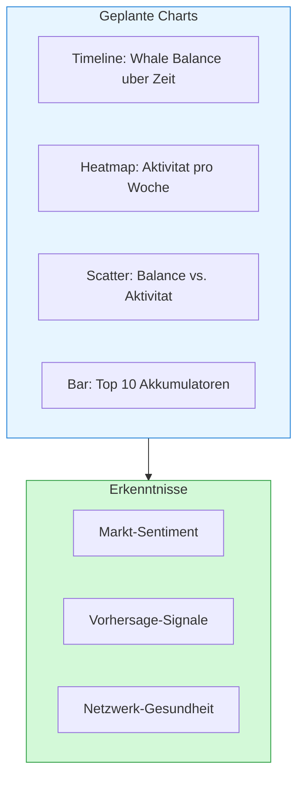

---

## Notebook 04: Visualization (Geplant)

### Geplante Dashboards

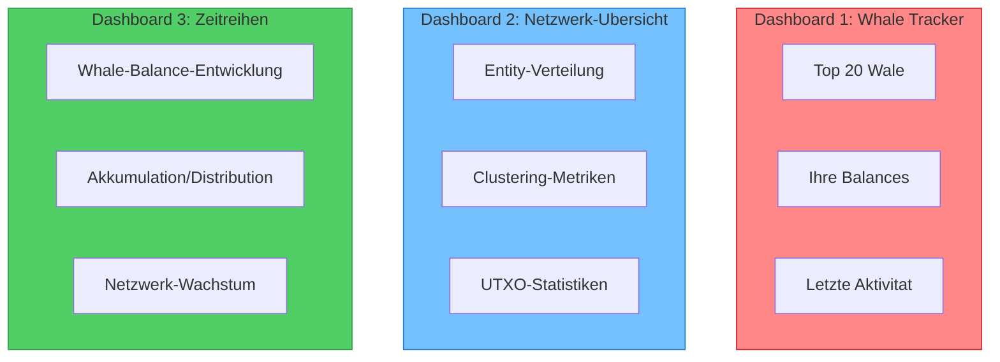

---

## Datenfluss: Komplette Pipeline

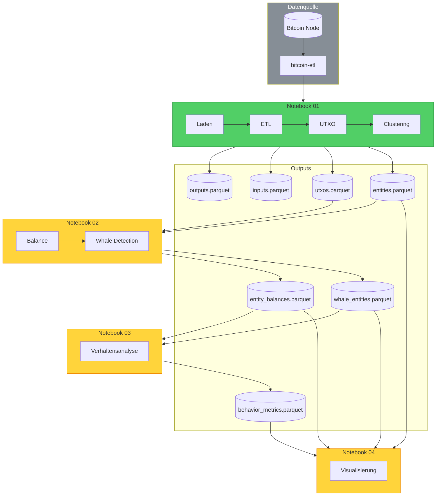

---

## Detaillierter Input/Output je Schritt

### Schritt-fur-Schritt Transformation

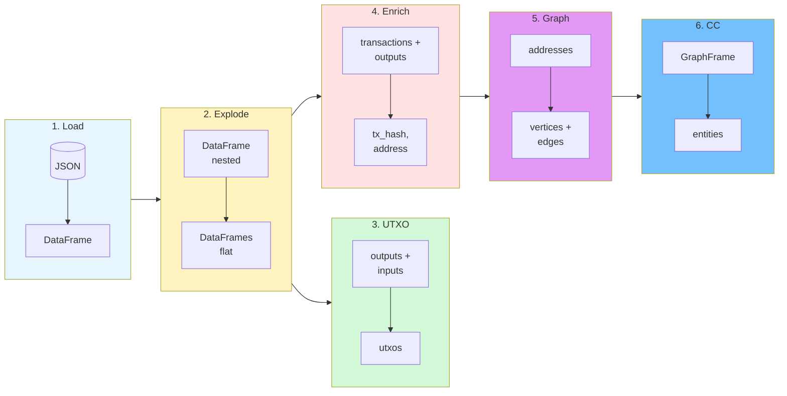

### Datenvolumen pro Schritt

| Schritt | Input | Output | Volumen |
|---------|-------|--------|---------|
| Load | JSON | DataFrame | 382.402 TXs |
| Explode Outputs | 382k TXs | Flat Outputs | 769.081 Zeilen |
| Explode Inputs | 382k TXs | Flat Inputs | 632.295 Zeilen |
| UTXO | 769k + 632k | UTXOs | 177.041 Zeilen |
| Enrich | 382k + 769k | Clustering Inputs | 274.791 Zeilen |
| Graph | 57.606 TXs | Vertices + Edges | 147.907 + 400.872 |
| CC | Graph | Entities | ~110.000 Entities |

---

## Ausfuhrungs-Reihenfolge

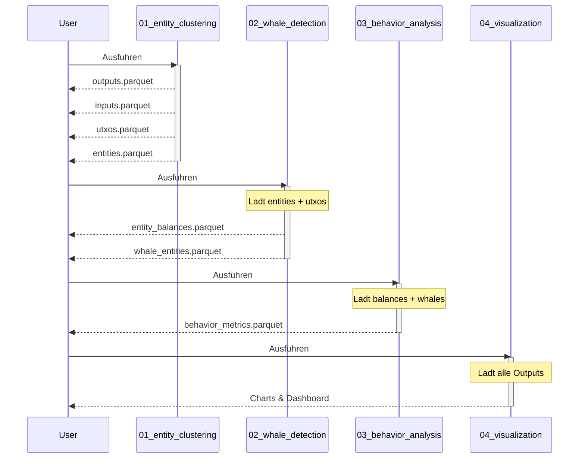

---

## Checkliste

### Notebook 01 - Entity Clustering

- [x] Spark Session konfigurieren
- [x] Transaktionen laden (JSON)
- [x] Blocks laden (JSON)
- [x] Outputs explodieren
- [x] Inputs explodieren
- [x] Parquet speichern (outputs, inputs)
- [x] UTXO Set berechnen
- [x] Parquet speichern (utxos)
- [x] Multi-Input TXs filtern
- [x] Adressen anreichern
- [x] Graph aufbauen (Vertices, Edges)
- [x] Connected Components ausfuhren
- [x] Parquet speichern (entities)
- [x] Statistiken visualisieren

### Notebook 02 - Whale Detection (Geplant)

- [ ] Entities laden
- [ ] UTXOs laden
- [ ] Join: UTXO -> Entity
- [ ] Aggregation: Balance pro Entity
- [ ] Klassifikation: Whale ja/nein
- [ ] Top Whales identifizieren
- [ ] Parquet speichern

### Notebook 03 - Verhaltensanalyse (Geplant)

- [ ] Balance-Zeitreihen erstellen
- [ ] Delta berechnen
- [ ] Akkumulation/Distribution klassifizieren
- [ ] Pattern Detection
- [ ] Metriken speichern

### Notebook 04 - Visualization (Geplant)

- [ ] Alle Daten laden
- [ ] Dashboard: Whale Tracker
- [ ] Dashboard: Netzwerk-Ubersicht
- [ ] Dashboard: Zeitreihen
- [ ] Export: Charts
