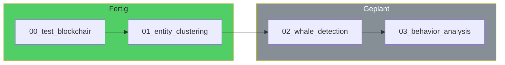
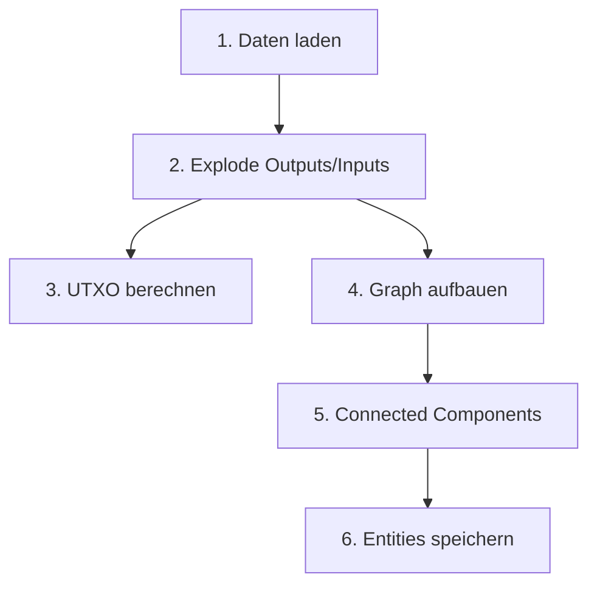
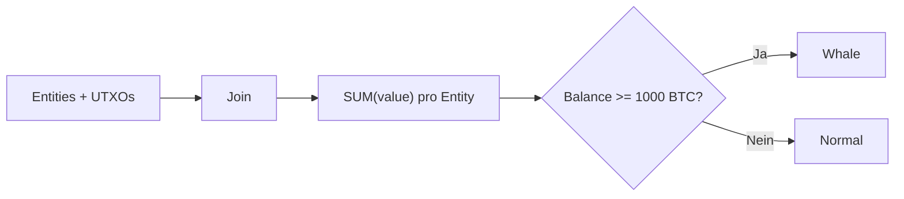
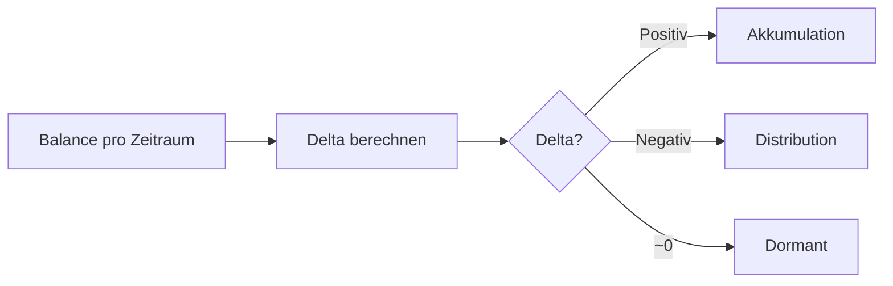

# Bitcoin Whale Intelligence - Notebook Workflow

> Analyse-Pipeline: Notebooks, Status und Datenfluss

## Inhaltsverzeichnis

- [Pipeline-Uebersicht](#pipeline-uebersicht)
- [Notebook 01: Entity Clustering](#notebook-01-entity-clustering-fertig)
- [Notebook 02: Whale Detection](#notebook-02-whale-detection-geplant)
- [Notebook 03: Verhaltensanalyse](#notebook-03-verhaltensanalyse-geplant)

---

## Pipeline-Uebersicht

| Notebook | Status | Output |
|----------|--------|--------|
| `00_test_blockchair_loading` | Fertig | Datenvalidierung |
| `01_entity_clustering` | Fertig | entities.parquet |
| `02_whale_detection` | Geplant | whale_entities.parquet |
| `03_behavior_analysis` | Geplant | behavior_metrics.parquet |

---

## Notebook 01: Entity Clustering (Fertig)

**Input**: `blockchair-downloader/` TSV-Dateien
**Output**: `outputs.parquet`, `inputs.parquet`, `utxos.parquet`, `entities.parquet`

**Metriken**: 382k TXs, 769k Outputs, ~150k Adressen -> ~110k Entities (25% Reduktion)

---

## Notebook 02: Whale Detection (Geplant)

**Input**: `entities.parquet`, `utxos.parquet`
**Output**: `entity_balances.parquet`, `whale_entities.parquet`

---

## Notebook 03: Verhaltensanalyse (Geplant)

**Input**: `entity_balances.parquet`, `whale_entities.parquet`
**Output**: `behavior_metrics.parquet`

**Ziel**: Erkennen ob Wale kaufen, verkaufen oder halten.
