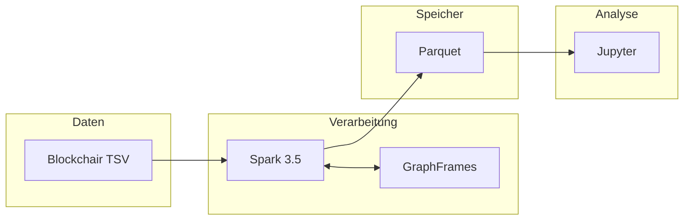
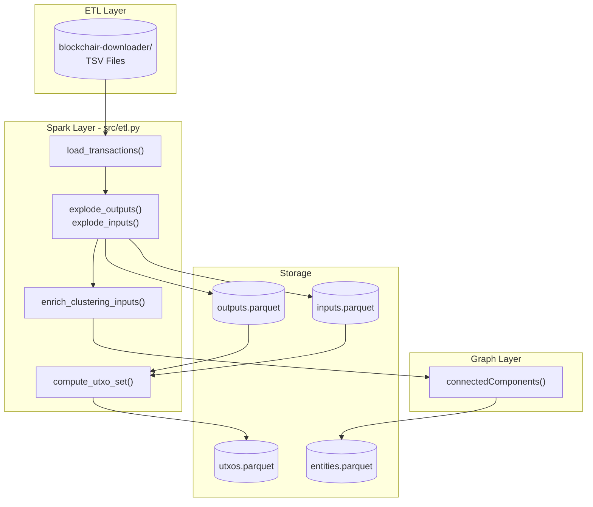
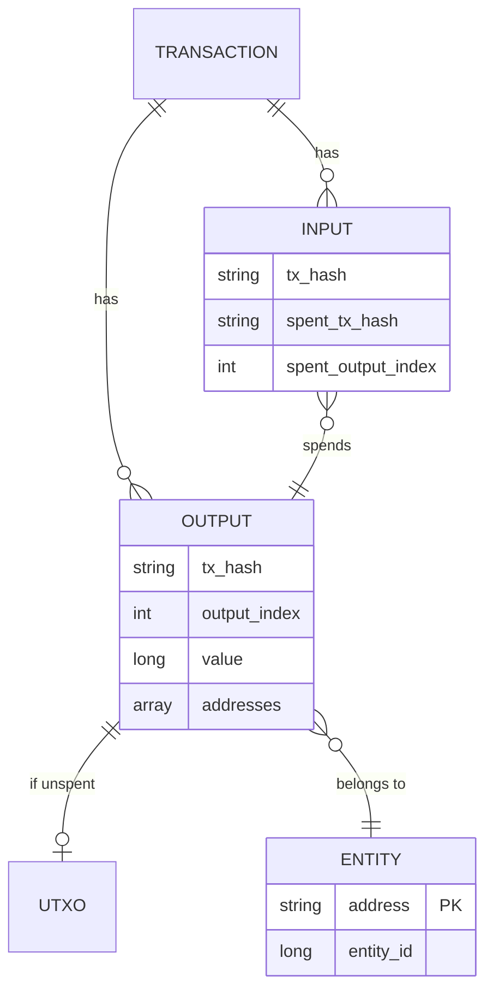
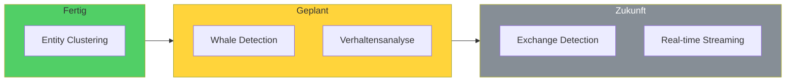

# Bitcoin Whale Intelligence - Technischer Kontext

> Architektur, Tech Stack und Datenmodell fuer Entwickler

## Inhaltsverzeichnis

- [Tech Stack](#tech-stack)
- [Architektur](#architektur)
- [Datenmodell](#datenmodell)
- [Algorithmen](#algorithmen)
- [Performance](#performance)
- [Roadmap](#roadmap)

---

## Tech Stack



| Technologie | Zweck |
|-------------|-------|
| **Apache Spark** | Verteilte Verarbeitung, skaliert auf TB |
| **GraphFrames** | Connected Components auf Mrd. Kanten |
| **Parquet** | Kompression 70-90%, Column Pruning |
| **Jupyter** | Interaktive Analyse |

---

## Architektur



---

## Datenmodell



**Parquet-Dateien**:
- `outputs.parquet` - Alle TX-Outputs mit Adressen
- `inputs.parquet` - Alle TX-Inputs mit Spent-Referenzen
- `utxos.parquet` - Unspent Outputs (Balance-Grundlage)
- `entities.parquet` - Adresse -> Entity-ID Mapping

---

## Algorithmen

### Common Input Ownership Heuristic

```
Wenn TX mehrere Input-Adressen hat
  -> Absender besitzt alle Private Keys
  -> Alle Adressen gehoeren einer Entity
```

**Ausnahmen**: CoinJoin, Exchange Consolidation (gefiltert via `max_inputs <= 50`)

### Connected Components

1. Jeder Knoten (Adresse) erhaelt eigene Component-ID
2. Iterativ: Sende ID an Nachbarn, uebernehme kleinste
3. Wiederhole bis Konvergenz
4. **Checkpointing** alle N Iterationen gegen Lineage-Explosion

---

## Performance

| Datenmenge | Transaktionen | Clustering-Zeit |
|------------|---------------|-----------------|
| Testdaten (H1 2011) | 382k | ~2 Min |
| 1 Jahr (2015) | ~50M | ~30 Min |
| Volle Blockchain | 900M+ | ~8h auf Cluster |

**Spark-Config**:
- `driver.memory: 8g`
- `adaptive.enabled: true`
- `shuffle.partitions: 200`

---

## Roadmap



| Phase | Beschreibung |
|-------|--------------|
| **Entity Clustering** | Adressen gruppieren via Multi-Input Heuristik |
| **Whale Detection** | Balance pro Entity, Top-Wale identifizieren |
| **Verhaltensanalyse** | Akkumulation vs. Distribution Patterns |
| **Exchange Detection** | Bekannte Exchanges erkennen und taggen |
