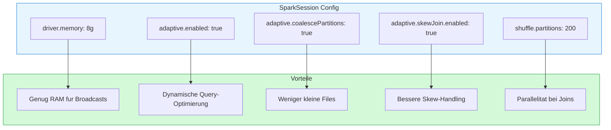

# Bitcoin Whale Intelligence - Technischer Kontext

> Dokumentation fur Entwickler: Architektur, Tech Stack und Performance-Uberlegungen

---

## Tech Stack

### Ubersicht

### Technologie-Begrundung

| Technologie | Zweck | Warum diese Wahl? |
|-------------|-------|-------------------|
| **Apache Spark** | Verteilte Datenverarbeitung | Skaliert auf Terabytes, SQL-API, Python-Bindings |
| **GraphFrames** | Graph-Algorithmen | Connected Components auf Milliarden Kanten |
| **Parquet** | Datenspeicherung | Kompression 70-90%, Column Pruning, Predicate Pushdown |
| **bitcoin-etl** | Datenexport | Standard-Tool, gepflegte Schemas |
| **Jupyter** | Interaktive Analyse | Visualisierung, iterative Entwicklung |

---

## Architektur im Detail

### Komponentendiagramm

### Datenfluss im Detail

---

## Datenmodell

### Schema-Ubersicht

### Physisches Datenmodell (Parquet)

---

## Algorithmen

### Common Input Ownership Heuristic

### Connected Components Algorithmus

### UTXO Set Berechnung

---

## Performance-Uberlegungen

### Spark-Konfiguration

### Bottlenecks und Losungen

### Skalierungsverhalten

---

## Codestruktur

### Modul-Ubersicht

### Funktionsabhangigkeiten

---

## Deployment-Optionen

### Lokale Entwicklung

### Cluster-Deployment (Produktiv)

---

## Erweiterungsmoglichkeiten

### Geplante Features

### Integration mit anderen Systemen

