# Bitcoin Whale Intelligence - Einfache Erklarung

> **Ziel**: Versteckte Bitcoin-Besitzer ("Wale") sichtbar machen, die ihr Vermogen auf viele Adressen verteilen.

---

## Das Problem: Wer besitzt wirklich die Bitcoin?

### Die Blockchain zeigt nur Adressen - keine Besitzer

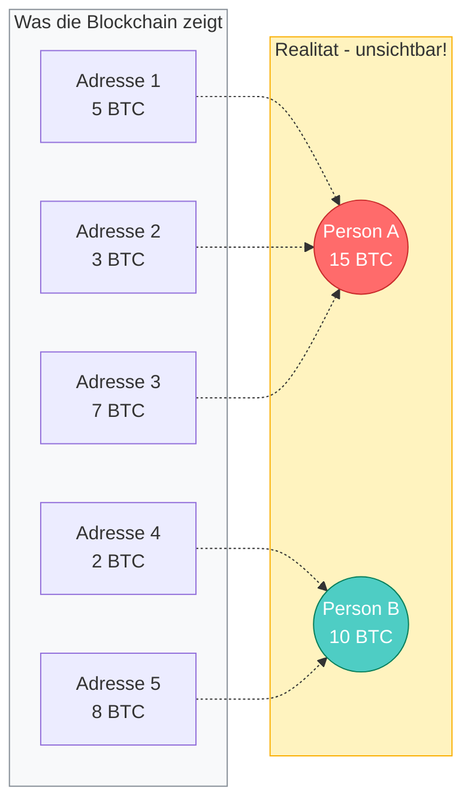

### Das Wal-Problem visualisiert

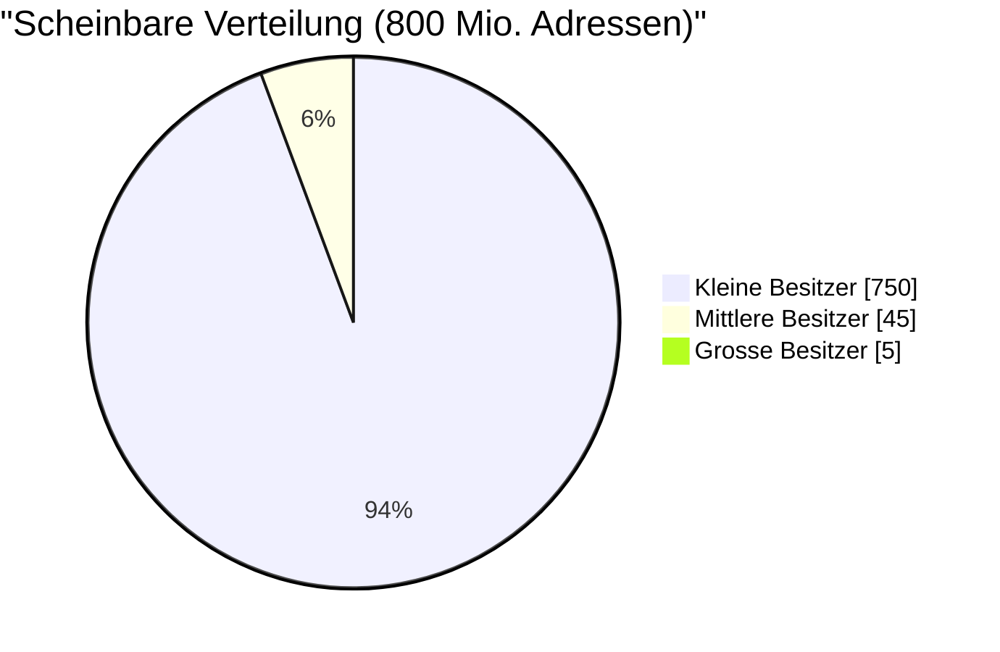

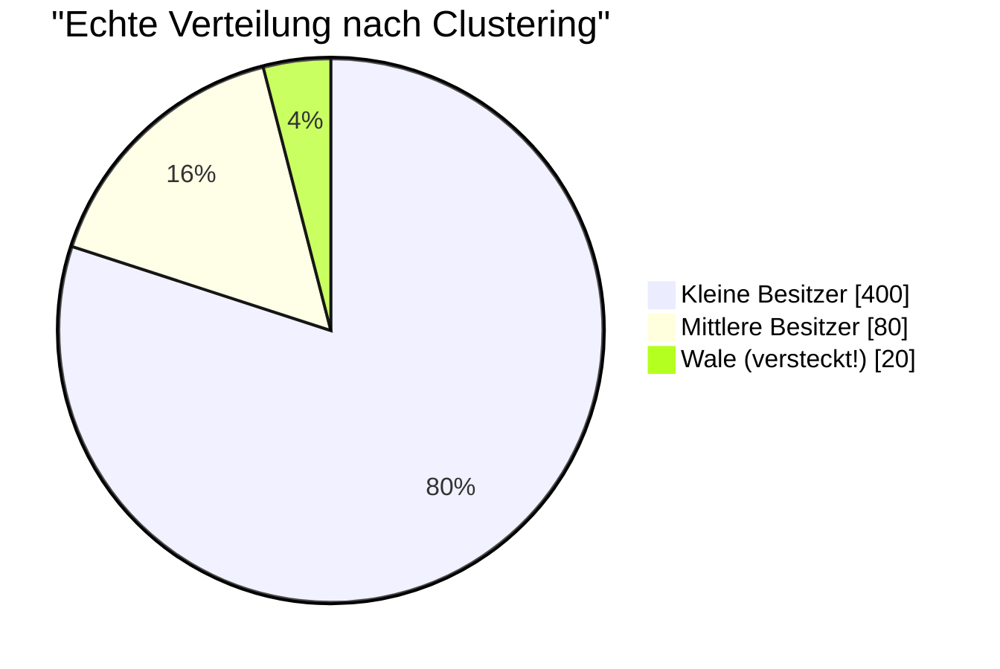

---

## Wie funktioniert Bitcoin? Das UTXO-Modell

### Bank vs. Bitcoin: Ein fundamentaler Unterschied

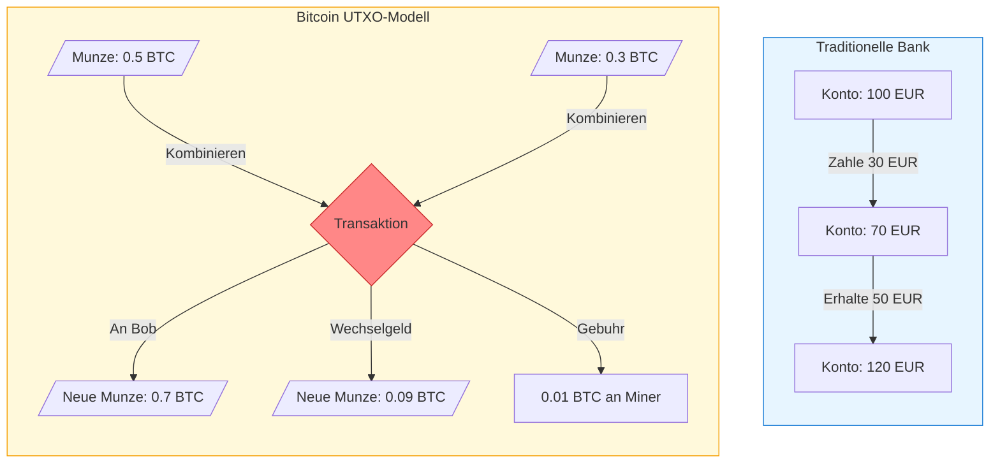

### UTXO - Unspent Transaction Output

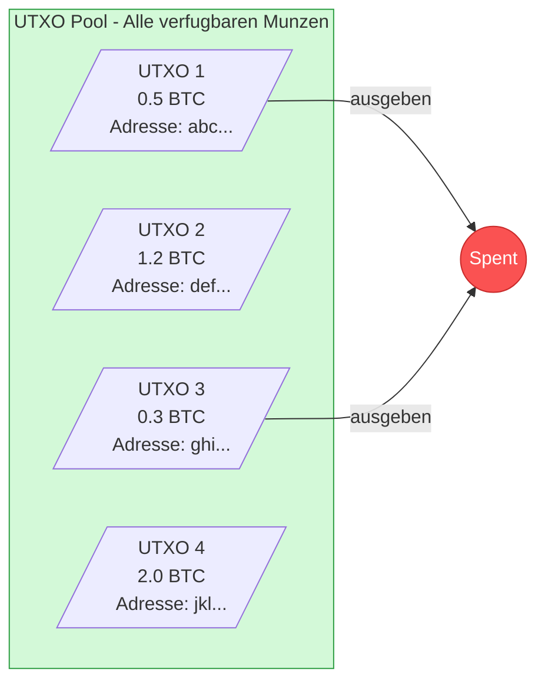

---

## Die Losung: Common Input Ownership Heuristic

### Der Trick: Wer kann mehrere Adressen gleichzeitig nutzen?

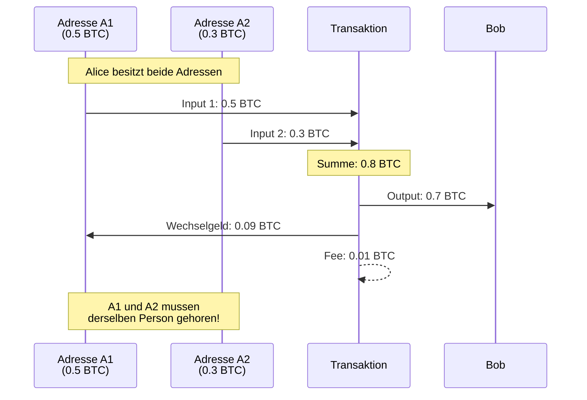

### Warum funktioniert das?

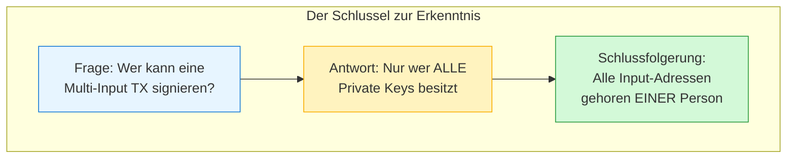

### Beispiel: Multi-Input Transaktion entlarven

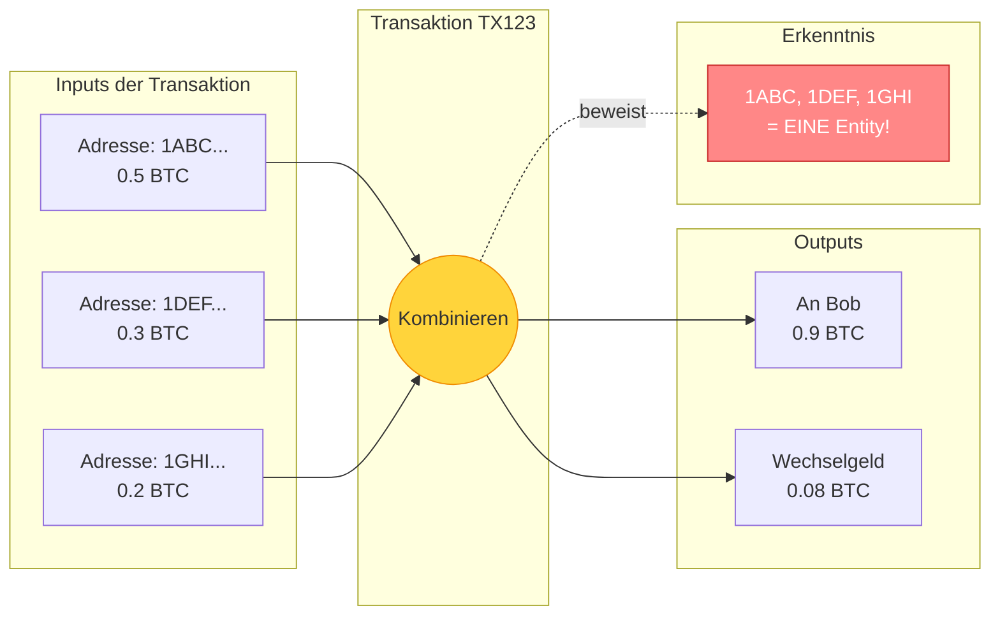

---

## Entity Clustering: Der Graph-Algorithmus

### Von Transaktionen zum Graphen

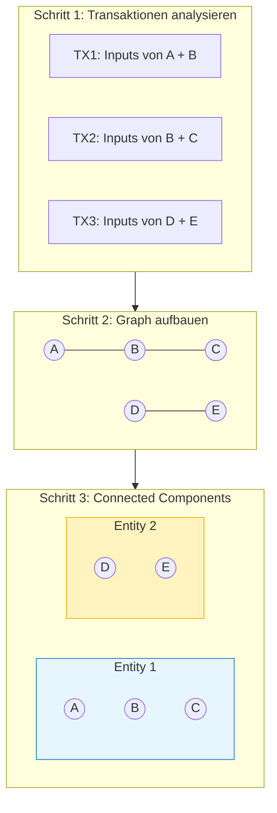

### Transitive Verknupfung: Warum es funktioniert

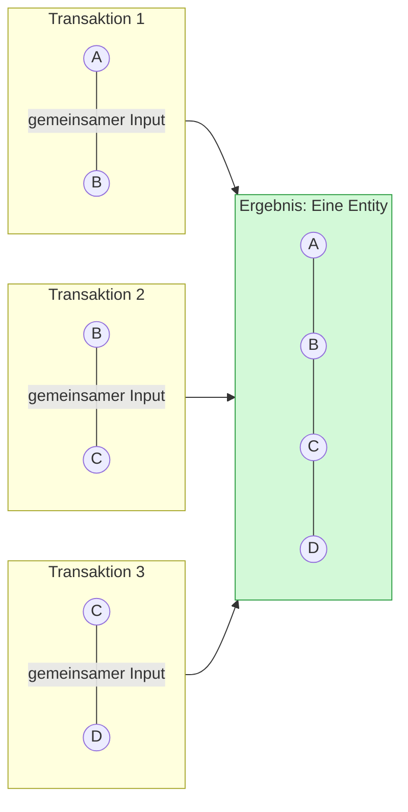

### Konkretes Beispiel aus echten Daten

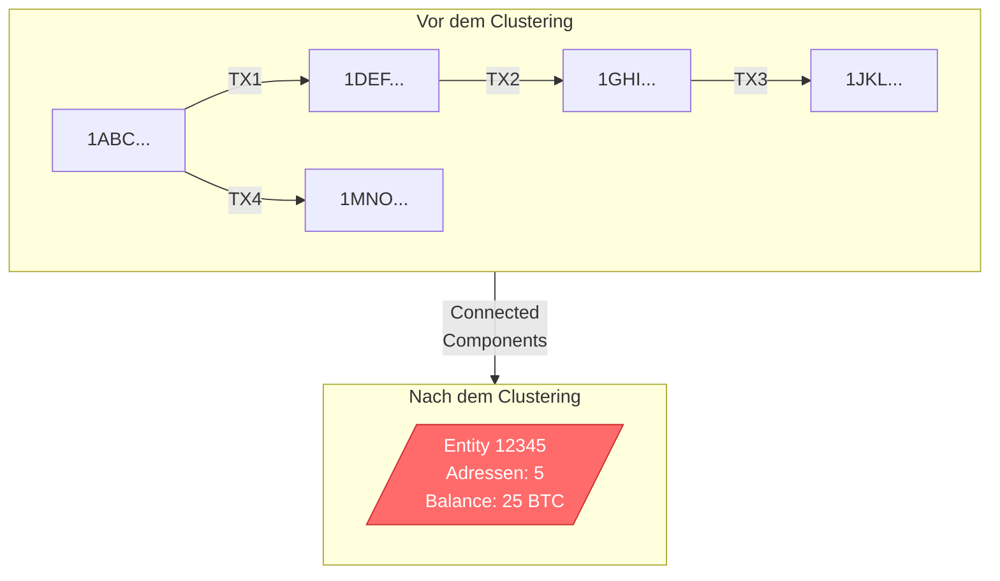

---

## Die komplette Pipeline

### Von Rohdaten bis zur Whale Detection

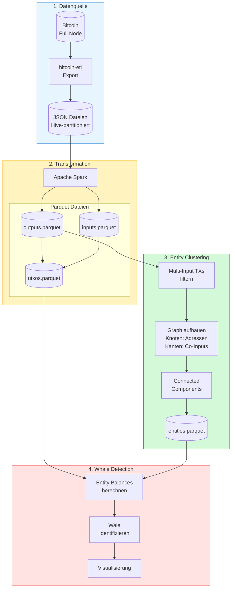

### Detaillierter ETL-Prozess

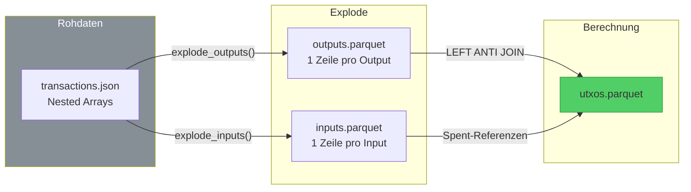

---

## Statistiken aus dem Projekt

### Transaktionstypen

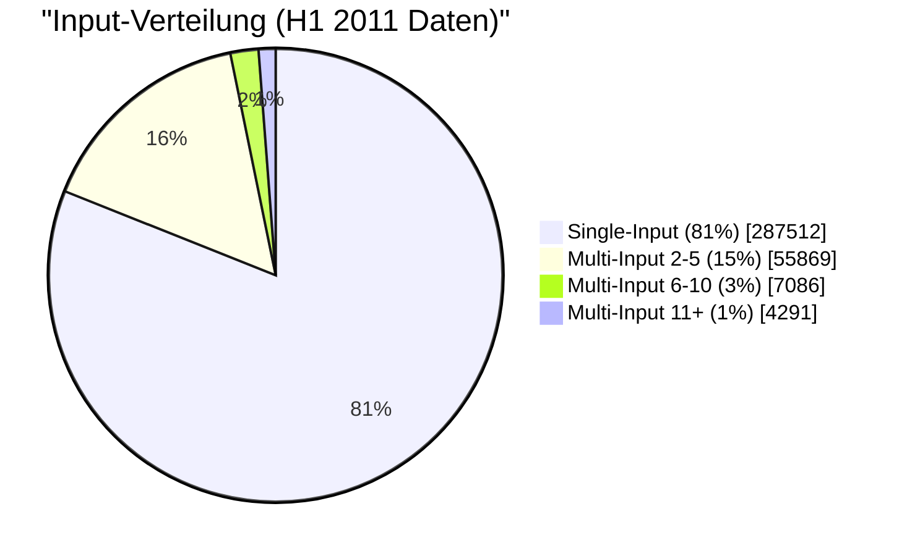

### UTXO vs. Spent Outputs

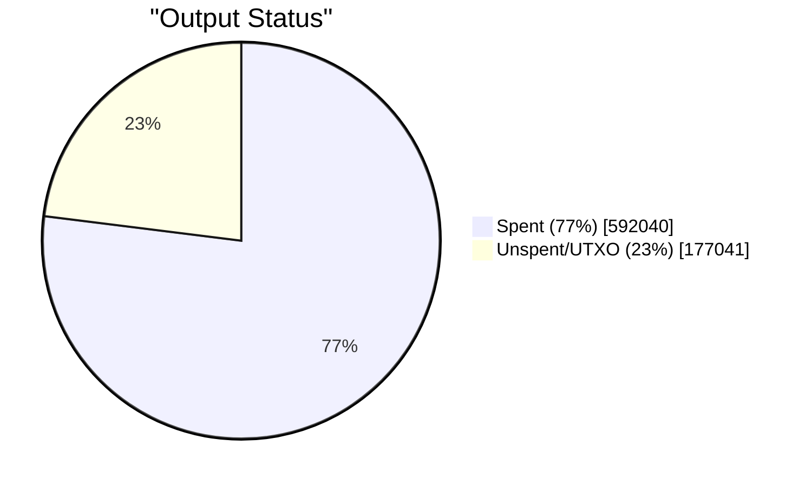

### Clustering-Ergebnis

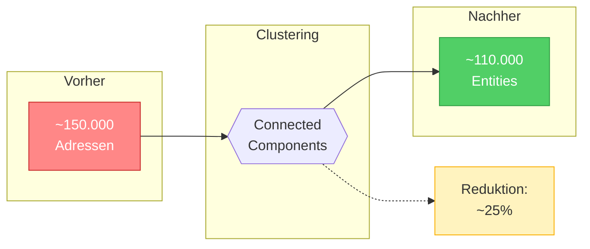

---

## Erwartete Ergebnisse

### Entity-Grossen nach Clustering

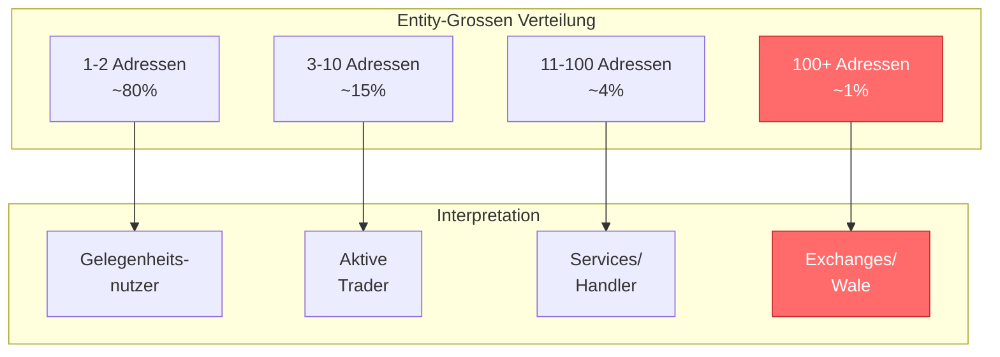

### Was wir uber Wale lernen konnen

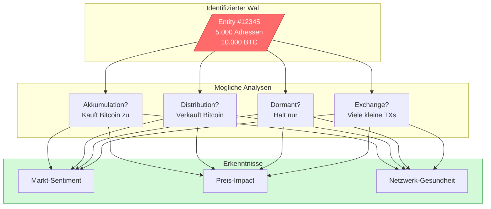

---

## Zusammenfassung

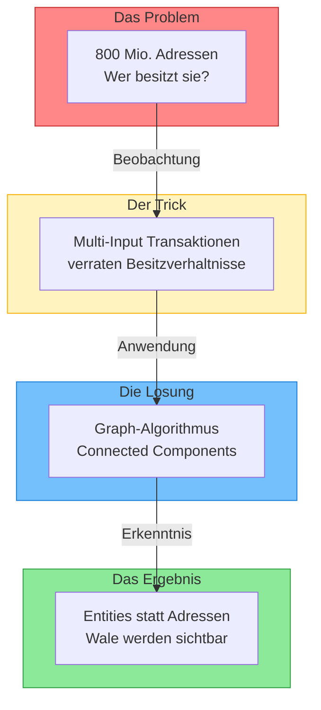
