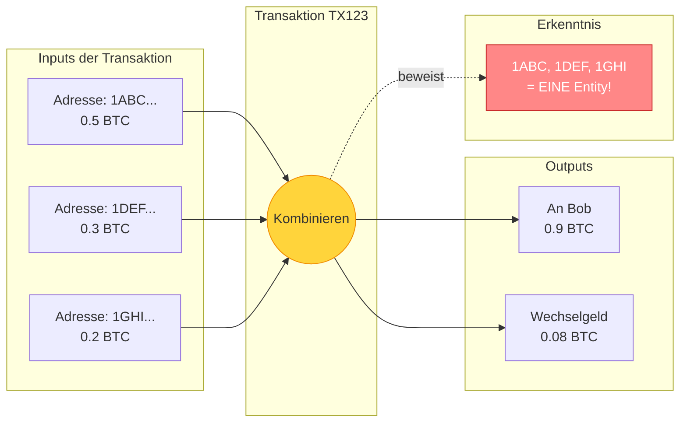
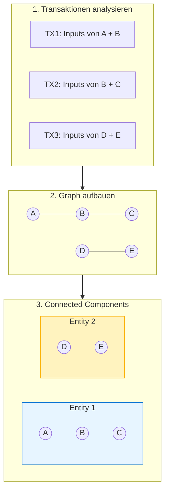
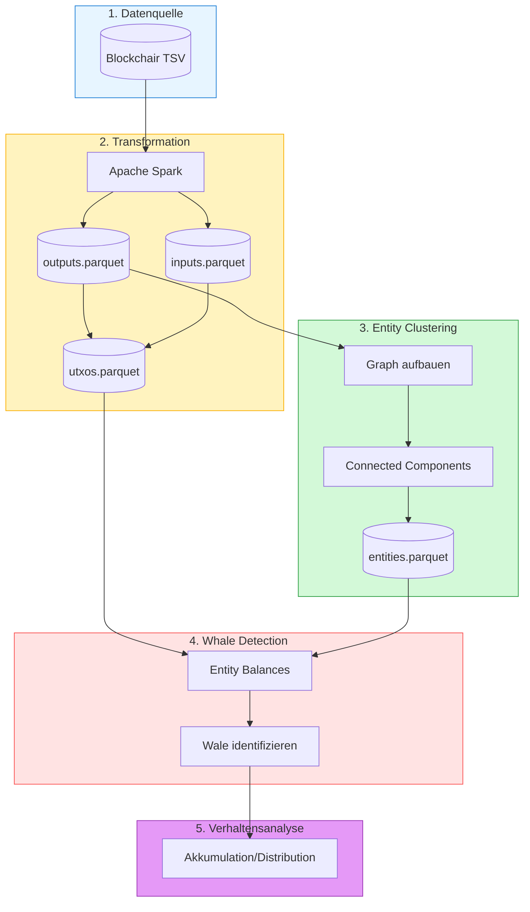
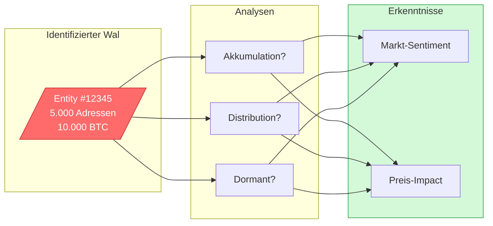
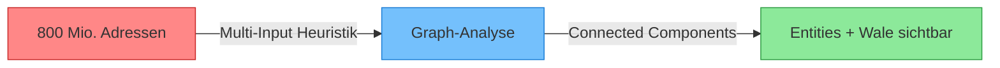

# Bitcoin Whale Intelligence - Einfache Erklaerung

> **Ziel**: Versteckte Bitcoin-Besitzer ("Wale") sichtbar machen, die ihr Vermoegen auf viele Adressen verteilen.

## Inhaltsverzeichnis

- [Das Problem](#das-problem-wer-besitzt-wirklich-die-bitcoin)
- [Die Loesung: Common Input Ownership](#die-loesung-common-input-ownership-heuristic)
- [Entity Clustering](#entity-clustering-der-graph-algorithmus)
- [Die komplette Pipeline](#die-komplette-pipeline)
- [Projekt-Roadmap](#projekt-roadmap)

---

## Das Problem: Wer besitzt wirklich die Bitcoin?

Die Blockchain zeigt nur Adressen - keine Besitzer. Ein Wal kann sein Vermoegen auf hunderte Adressen verteilen.

---

## Die Loesung: Common Input Ownership Heuristic

**Kernidee**: Wer kann mehrere Adressen in EINER Transaktion als Input nutzen? Nur der Besitzer aller Private Keys!

---

## Entity Clustering: Der Graph-Algorithmus

Adressen werden zu Knoten, gemeinsame Inputs zu Kanten. Connected Components findet alle zusammengehoerenden Adressen.

**Ergebnis**: ~150.000 Adressen werden zu ~110.000 Entities (25% Reduktion).

---

## Die komplette Pipeline

---

## Projekt-Roadmap

| Phase | Status | Beschreibung |
|-------|--------|--------------|
| **Entity Clustering** | Fertig | Adressen zu Entities gruppieren |
| **Whale Detection** | Geplant | Balance pro Entity, Top-Wale finden |
| **Verhaltensanalyse** | Geplant | Akkumulation vs. Distribution erkennen |

### Was wir ueber Wale lernen koennen

---

## Zusammenfassung

