# Bitcoin Whale Intelligence - Pipeline-Architektur

> Dokumentation fuer Professor-Pitch: Wie wir versteckte Bitcoin-Wale finden

---

## Inhaltsverzeichnis

1. [Das Problem: Versteckte Wale](#1-das-problem-versteckte-wale)
2. [Bitcoin-Grundkonzepte](#2-bitcoin-grundkonzepte)
3. [Datenquelle: bitcoin-etl](#3-datenquelle-bitcoin-etl)
4. [Pipeline-Uebersicht](#4-pipeline-uebersicht)
5. [Schritt 1: Outputs extrahieren](#5-schritt-1-outputs-extrahieren)
6. [Schritt 2: Inputs extrahieren](#6-schritt-2-inputs-extrahieren)
7. [Schritt 3: UTXO-Set berechnen](#7-schritt-3-utxo-set-berechnen)
8. [Schritt 4a: Multi-Input Gruppierung](#8-schritt-4a-multi-input-gruppierung)
9. [Schritt 4b: Connected Components](#9-schritt-4b-connected-components)
10. [Schritt 5: Whale Detection](#10-schritt-5-whale-detection)
11. [Tech Stack und Begruendung](#11-tech-stack-und-begruendung)

---

## 1. Das Problem: Versteckte Wale

Ein Bitcoin-Wal kann sein Vermoegen auf viele Adressen verteilen. Auf der Blockchain sieht das aus wie viele kleine, unabhaengige Besitzer:

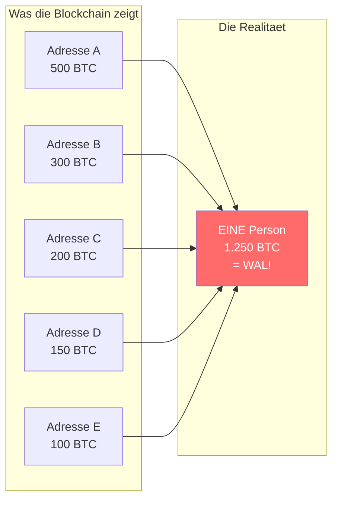

| Ohne Analyse | Mit unserer Analyse |
|--------------|---------------------|
| 5 unabhaengige Adressen | 1 Entity (Person/Firma) |
| Groesster Besitz: 500 BTC | Tatsaechlicher Besitz: 1.250 BTC |
| Kein Wal erkennbar | **WAL identifiziert!** |

**Ziel:** Adressen zu Entities gruppieren und grosse Besitzer ("Whales") finden.

---

## 2. Bitcoin-Grundkonzepte

### 2.1 Das UTXO-Modell (Wie Bitcoin funktioniert)

Bitcoin funktioniert **NICHT** wie ein Bankkonto mit Kontostand. Stattdessen besitzt man "Muenzen" (UTXOs) verschiedener Groesse:

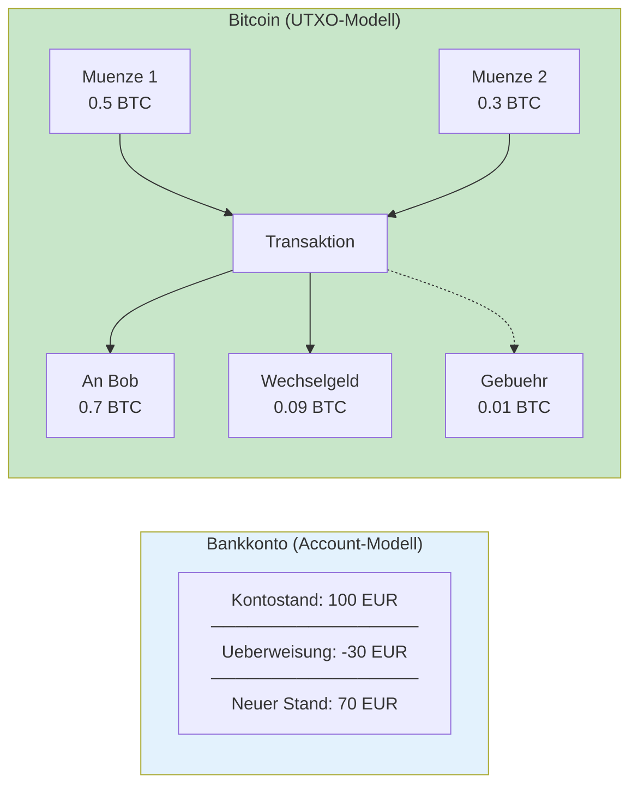

**Wichtig:** Muenzen (UTXOs) werden **vollstaendig** ausgegeben. Man bekommt Wechselgeld als neue Muenze zurueck.

| Begriff | Erklaerung |
|---------|-----------|
| **UTXO** | Unspent Transaction Output = Eine "Muenze" die noch nicht ausgegeben wurde |
| **Input** | Eine Muenze die in einer Transaktion ausgegeben wird |
| **Output** | Eine neue Muenze die durch eine Transaktion entsteht |

---

### 2.2 Adressen, Private Keys und Signaturen

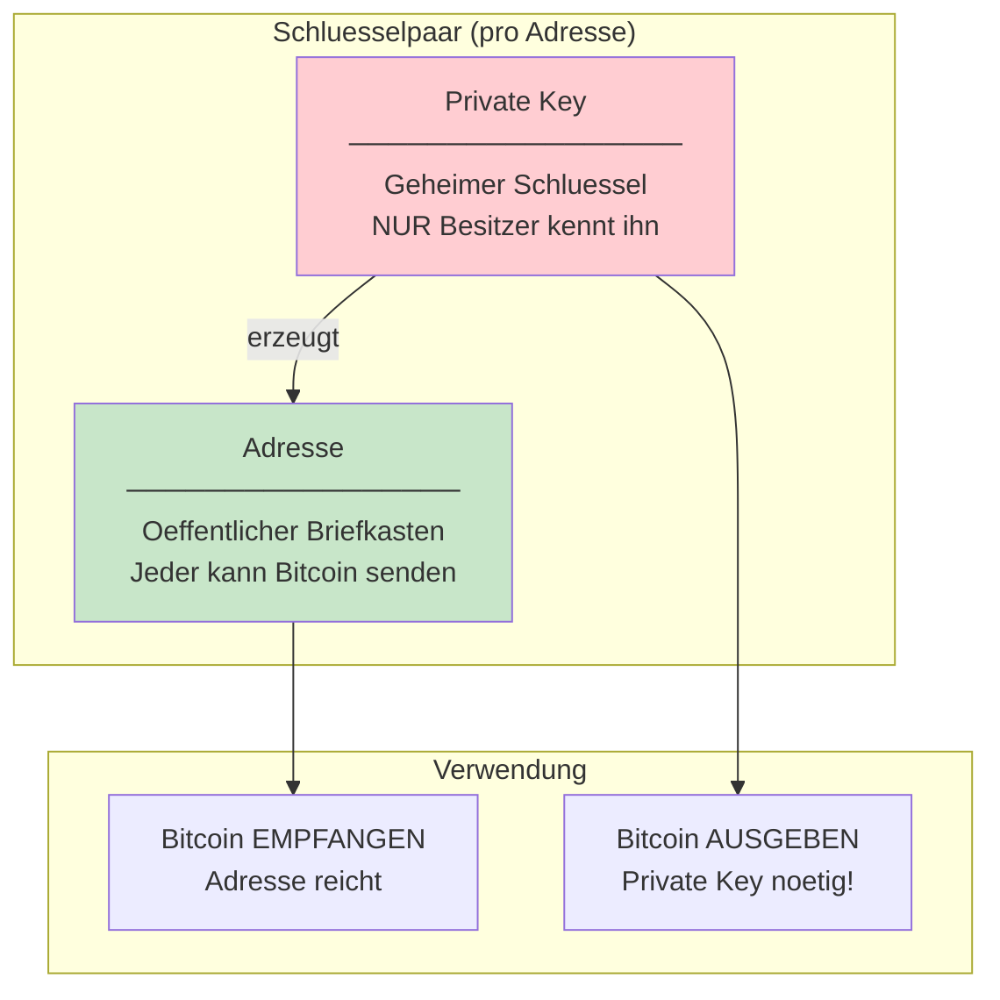

**Das ist der Kern unserer Analyse:**

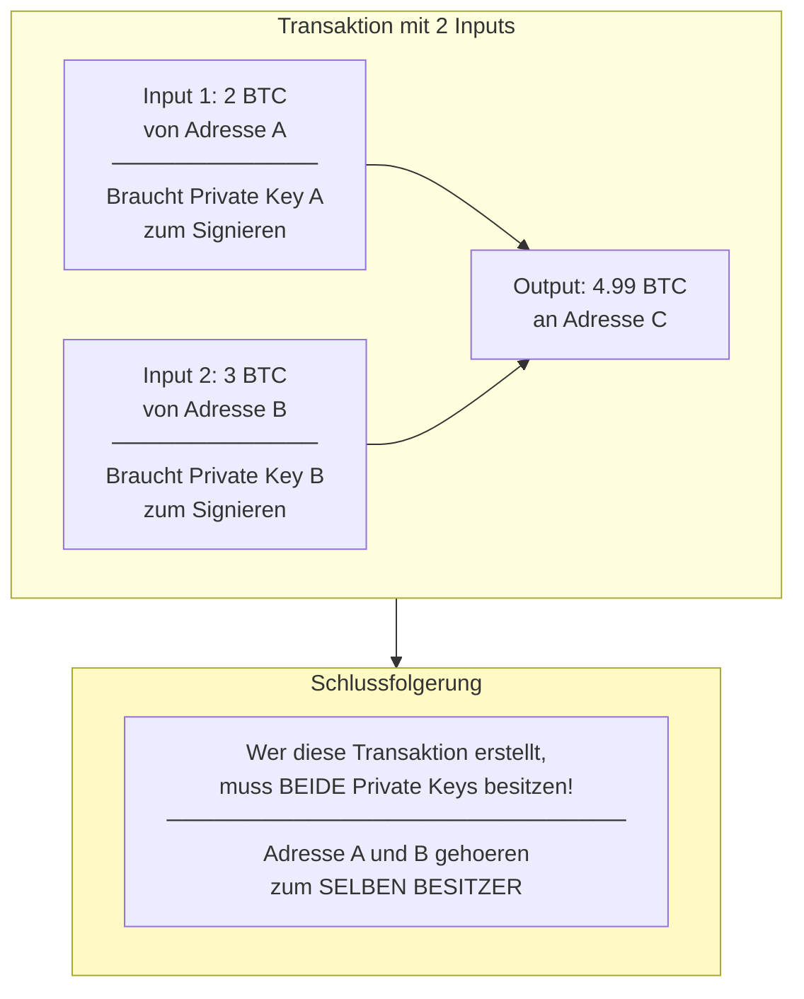

**Das ist die "Common Input Ownership Heuristic"** - die Grundlage unseres Entity Clusterings.

---

### 2.3 Wichtig: Nur INPUTS werden gruppiert, nicht Outputs!

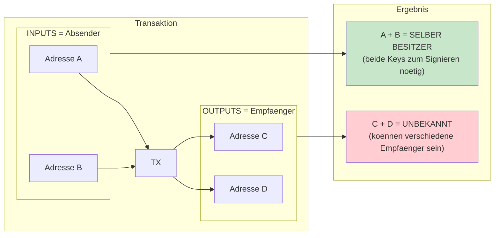

---

### 2.4 Warum eine Person viele Adressen hat

| Grund | Erklaerung |
|-------|-----------|
| **Wechselgeld** | Jede Transaktion erzeugt oft eine neue Adresse fuer Wechselgeld |
| **Privatsphaere** | Wallets generieren fuer jede Zahlung eine neue Empfangsadresse |
| **Organisation** | Boersen nutzen separate Adressen pro Kunde |

---

## 3. Datenquelle: bitcoin-etl

### 3.1 Woher kommen die Daten?

Wir nutzen [bitcoin-etl](https://github.com/blockchain-etl/bitcoin-etl), ein Tool das Blockchain-Daten von einem Bitcoin Full Node exportiert:

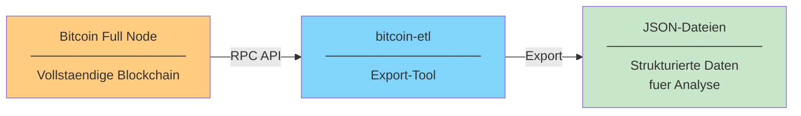

### 3.2 Verzeichnisstruktur der exportierten Daten

```
blockchain_exports/
└── YYYY-MM-DD_YYYY-MM-DD/          <- Zeitraum des Exports
    ├── blocks/
    │   └── date=YYYY-MM-DD/        <- Hive-Partitionierung nach Datum
    │       └── blocks_00000.json
    └── transactions/
        └── date=YYYY-MM-DD/
            └── transactions_00000.json   <- Das brauchen wir!
```

**Hive-Partitionierung:** Daten sind nach Datum in Ordner sortiert. Spark kann gezielt nur benoetigte Tage laden.

### 3.3 JSON-Struktur einer Transaktion

```json
{
  "hash": "f4184fc596403b9d638783cf57adfe4c75c605f6356fbc91338530e9831e9e16",
  "block_number": 170,
  "block_timestamp": 1231731025,
  "is_coinbase": false,

  "inputs": [
    {
      "index": 0,
      "spent_transaction_hash": "0437cd7f8525...",
      "spent_output_index": 0,
      "addresses": ["12cbQLTFMXRnSzktFkuoG3eHoMeFtpTu3S"],
      "value": 5000000000
    }
  ],

  "outputs": [
    {
      "index": 0,
      "addresses": ["1Q2TWHE3GMdB6BZKafqwxXtWAWgFt5Jvm3"],
      "value": 1000000000,
      "type": "pubkeyhash"
    },
    {
      "index": 1,
      "addresses": ["12cbQLTFMXRnSzktFkuoG3eHoMeFtpTu3S"],
      "value": 4000000000
    }
  ]
}
```

**Wichtige Felder:**

| Feld | Bedeutung |
|------|-----------|
| `hash` | Eindeutige ID der Transaktion |
| `inputs[].spent_transaction_hash` | Verweis auf vorherige TX (welche Muenze wird ausgegeben) |
| `inputs[].spent_output_index` | Welcher Output der vorherigen TX |
| `inputs[].addresses` | Wer signiert (= Absender) |
| `outputs[].addresses` | Wer empfaengt |
| `outputs[].value` | Betrag in Satoshi (1 BTC = 100.000.000 Satoshi) |

---

## 4. Pipeline-Uebersicht

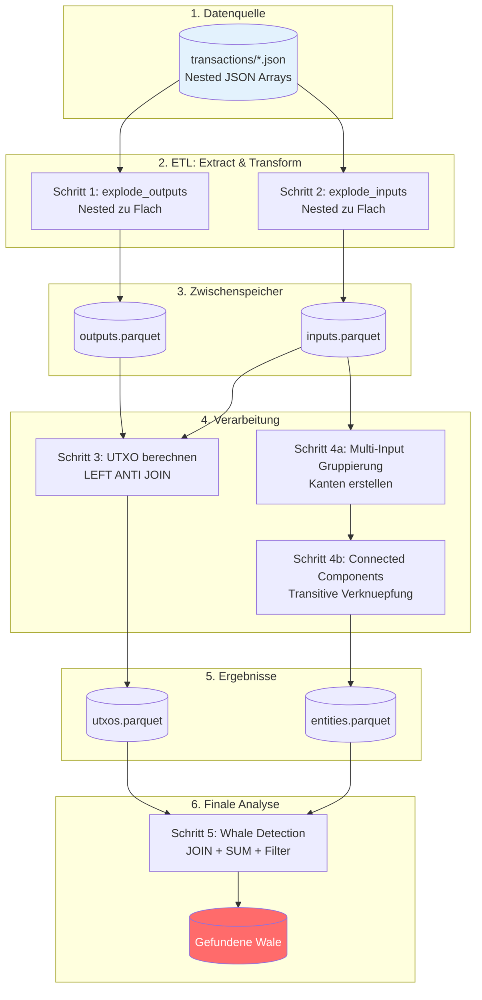

---

## 5. Schritt 1: Outputs extrahieren

### Problem: Nested Arrays in JSON

Die Rohdaten haben **verschachtelte Arrays** - eine Transaktion enthaelt mehrere Outputs als Liste:

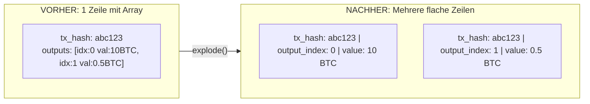

### Warum diese Transformation?

| Problem mit Nested | Loesung mit Flach |
|-------------------|------------------|
| Kein GROUP BY moeglich | GROUP BY address funktioniert |
| Kein JOIN moeglich | JOIN ueber tx_hash + index |
| Schwer zu filtern | Einfache WHERE-Bedingungen |

---

## 6. Schritt 2: Inputs extrahieren

Gleiche Logik wie bei Outputs:

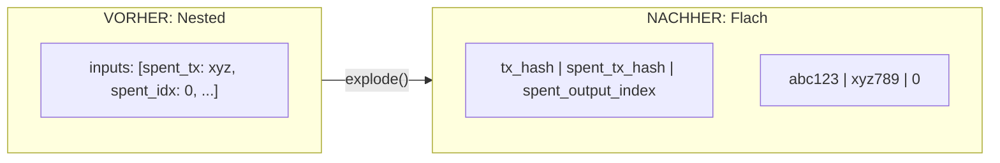

**Wichtig:** Der Input enthaelt einen **Verweis auf einen vorherigen Output** (`spent_tx_hash` + `spent_output_index`). Das brauchen wir fuer die UTXO-Berechnung.

---

## 7. Schritt 3: UTXO-Set berechnen

### Was ist das UTXO-Set?

**Alle Outputs die NOCH NICHT ausgegeben wurden** = Alle "Muenzen" die noch existieren.

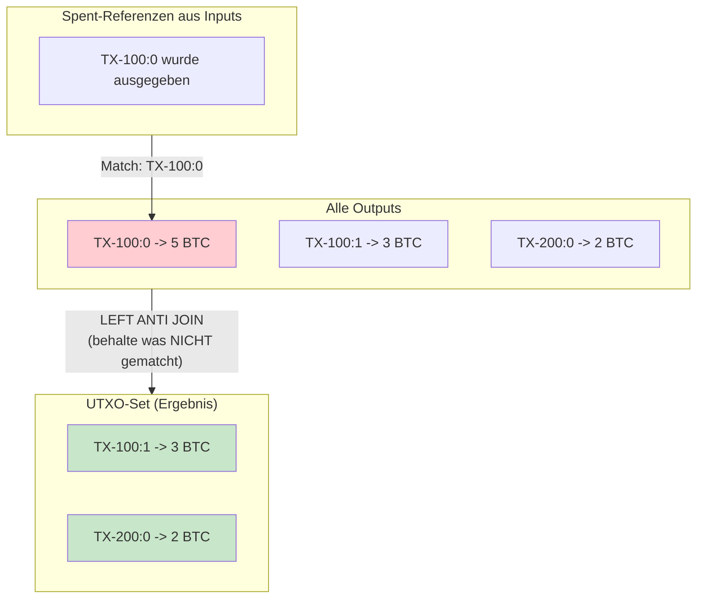

### Warum LEFT ANTI JOIN?

| JOIN-Typ | Ergebnis |
|----------|----------|
| INNER JOIN | Nur Matches -> Spent Outputs |
| LEFT JOIN | Alle + Matches -> Mit NULL-Markierung |
| **LEFT ANTI JOIN** | Nur was NICHT matcht -> **UTXOs!** |

---

## 8. Schritt 4a: Multi-Input Gruppierung

### Innerhalb jeder Transaktion: Kanten erstellen

Fuer jede Transaktion mit mehreren Inputs werden die Input-Adressen als **Kanten** verbunden:

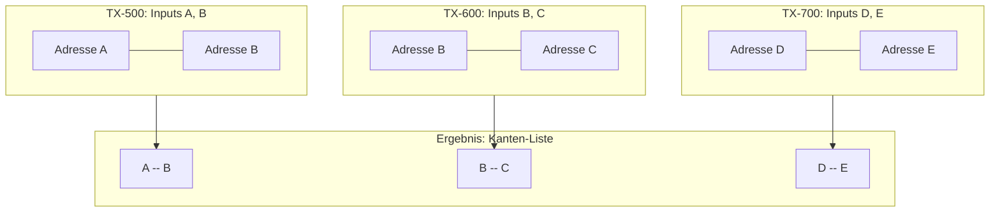

**Warum nur Inputs?** Nur der Absender muss alle Private Keys besitzen. Outputs koennen an beliebige Empfaenger gehen.

---

## 9. Schritt 4b: Connected Components

### Ueber Transaktionen hinweg: Transitive Verknuepfung

Der Graph-Algorithmus findet alle **transitiv verbundenen** Adressen:

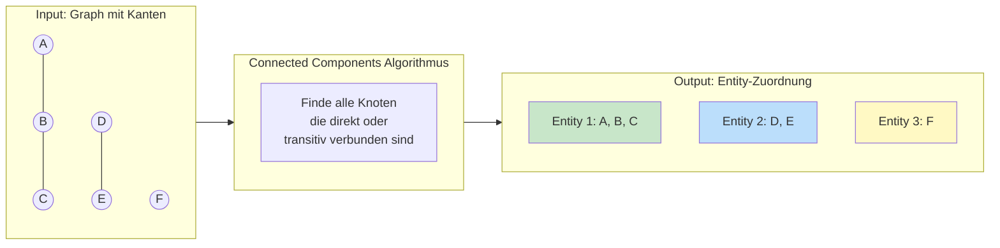

### Beispiel der transitiven Verknuepfung

```
TX-500: Inputs [A, B]     -> Kante: A -- B
TX-600: Inputs [B, C]     -> Kante: B -- C
────────────────────────────────────────────
Ergebnis: A -- B -- C     -> Entity 1: {A, B, C}

TX-700: Inputs [D, E]     -> Kante: D -- E
────────────────────────────────────────────
Ergebnis: D -- E          -> Entity 2: {D, E}
```

**A und C haben NIE zusammen eine Transaktion gemacht, aber ueber B sind sie transitiv verbunden!**

---

## 10. Schritt 5: Whale Detection

### Finale Berechnung

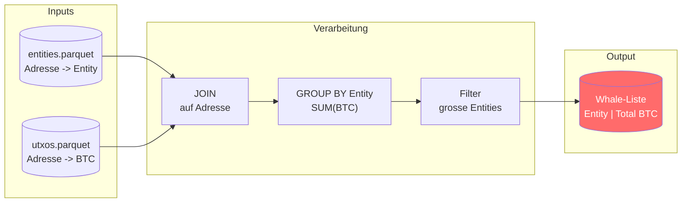

### Beispielrechnung

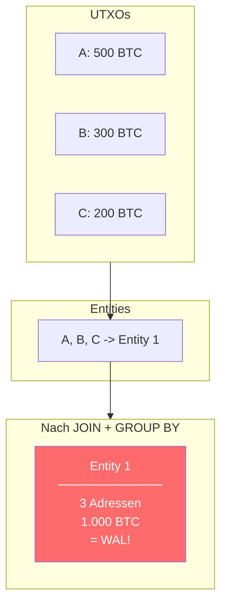

---

## 11. Tech Stack und Begruendung

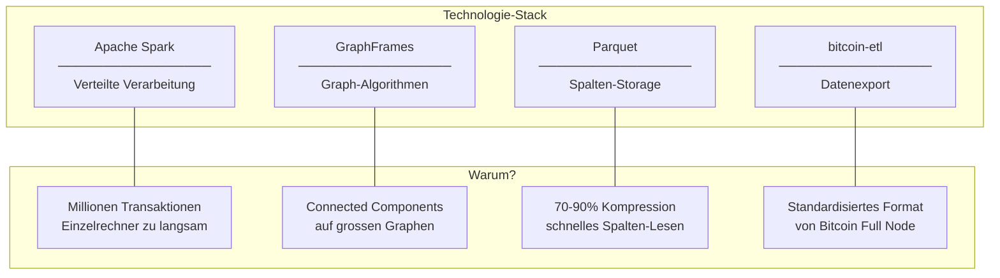

| Technologie | Zweck | Warum diese Wahl? |
|-------------|-------|-------------------|
| **Apache Spark** | Verteilte Datenverarbeitung | Skaliert auf Cluster, verarbeitet TB an Daten |
| **GraphFrames** | Graph-Algorithmen | Connected Components auf Millionen Knoten moeglich |
| **Parquet** | Datenspeicherung | 70-90% kleiner als JSON, spaltenbasiert = schnelle Abfragen |
| **bitcoin-etl** | Blockchain-Export | Open Source, gut dokumentiert, Industriestandard |

---

## Zusammenfassung

| Schritt | Was passiert | Ergebnis |
|---------|--------------|----------|
| 1. Outputs extrahieren | Nested -> Flach | outputs.parquet |
| 2. Inputs extrahieren | Nested -> Flach | inputs.parquet |
| 3. UTXO berechnen | LEFT ANTI JOIN | utxos.parquet |
| 4a. Multi-Input Gruppierung | Kanten pro TX | Graph-Kanten |
| 4b. Connected Components | Transitive Verknuepfung | entities.parquet |
| 5. Whale Detection | JOIN + SUM + Filter | Whale-Liste |
