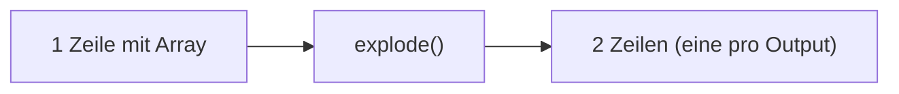
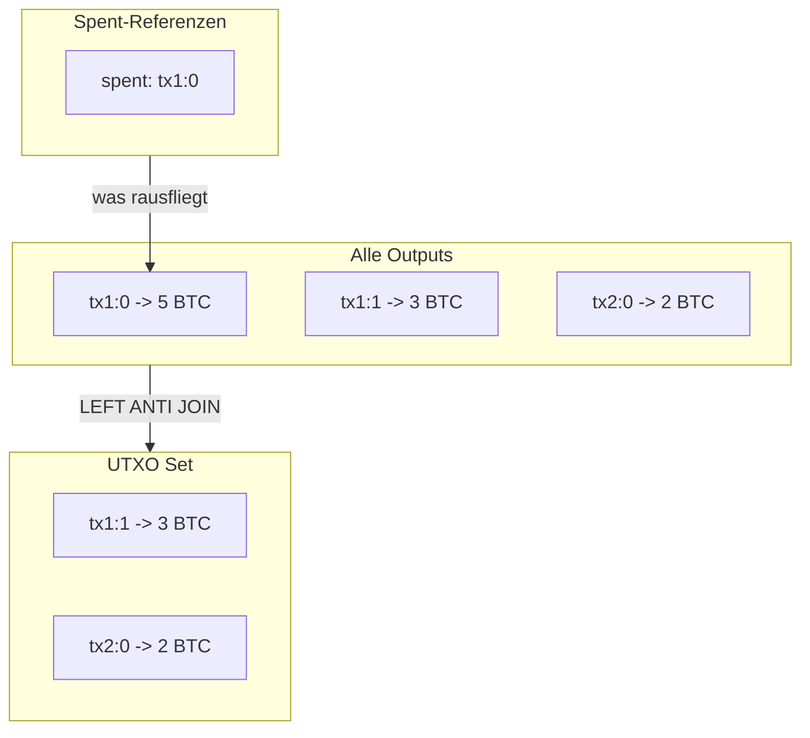
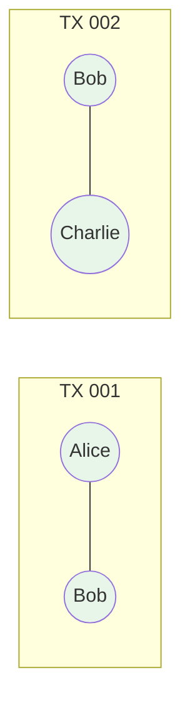
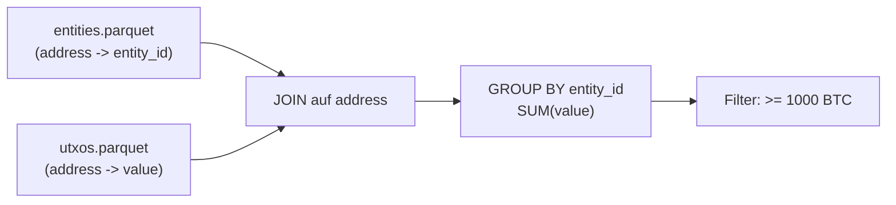
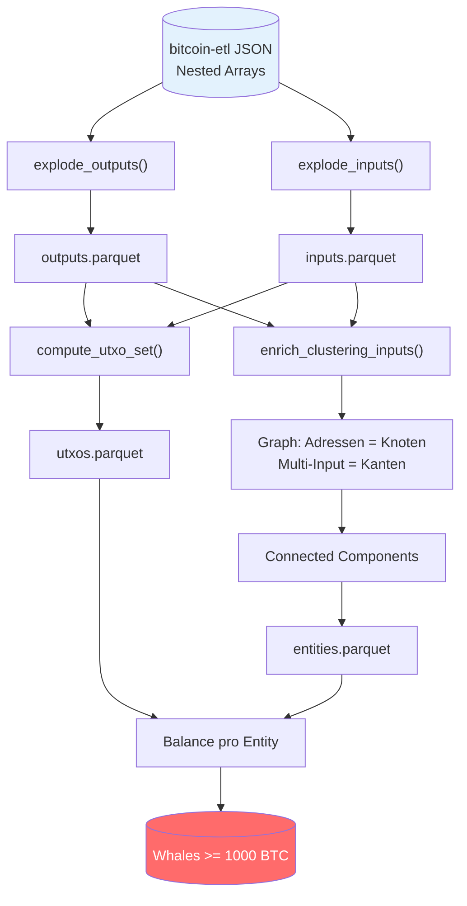

# Bitcoin Whale Intelligence - Daten-Pipeline

> Wie wir aus Rohdaten versteckte Bitcoin-Wale finden

## Inhaltsverzeichnis

1. [Die Rohdaten (bitcoin-etl JSON)](#1-die-rohdaten-bitcoin-etl-json)
2. [Schritt 1: explode_outputs()](#2-schritt-1-explode_outputs)
3. [Schritt 2: explode_inputs()](#3-schritt-2-explode_inputs)
4. [Schritt 3: UTXO Set berechnen](#4-schritt-3-utxo-set-berechnen)
5. [Schritt 4: Entity Clustering](#5-schritt-4-entity-clustering-common-input-ownership)
6. [Schritt 5: Whale Detection](#6-schritt-5-whale-detection)
7. [Die komplette Pipeline](#7-die-komplette-pipeline)
8. [Metriken](#8-metriken-h12011-testdaten)

---

## 1. Die Rohdaten (bitcoin-etl JSON)

**Eine Transaktion sieht so aus:**

```json
{
  "hash": "abc123...",
  "block_number": 126766,
  "is_coinbase": false,
  "input_count": 2,
  "output_count": 2,
  "inputs": [
    {
      "index": 0,
      "spent_transaction_hash": "prev111...",
      "spent_output_index": 0,
      "addresses": ["1Alice..."]
    },
    {
      "index": 1,
      "spent_transaction_hash": "prev222...",
      "spent_output_index": 1,
      "addresses": ["1Bob..."]
    }
  ],
  "outputs": [
    {
      "index": 0,
      "value": 50000000,
      "addresses": ["1Charlie..."]
    },
    {
      "index": 1,
      "value": 30000000,
      "addresses": ["1Alice..."]
    }
  ]
}
```

**Was bedeutet das?**
- `inputs`: Woher das Bitcoin kommt (referenziert frueheren Output)
- `outputs`: Wohin das Bitcoin geht (neue "Muenzen")
- `value`: Betrag in Satoshi (100.000.000 Satoshi = 1 BTC)

---

## 2. Schritt 1: explode_outputs()

**VORHER (nested):**

| tx_hash | outputs |
|---------|---------|
| abc123 | [{index:0, value:50000000, addr:"1Charlie"}, {index:1, value:30000000, addr:"1Alice"}] |

**WAS PASSIERT:**



**NACHHER (flach):**

| tx_hash | output_index | value | address |
|---------|--------------|-------|---------|
| abc123 | 0 | 50000000 | 1Charlie... |
| abc123 | 1 | 30000000 | 1Alice... |

**WARUM:** Flache Tabellen erlauben JOINs und Aggregationen mit SQL/Spark.

---

## 3. Schritt 2: explode_inputs()

**VORHER (nested):**

| tx_hash | inputs |
|---------|--------|
| abc123 | [{spent_tx:"prev111", spent_idx:0}, {spent_tx:"prev222", spent_idx:1}] |

**NACHHER (flach):**

| tx_hash | spent_tx_hash | spent_output_index |
|---------|---------------|-------------------|
| abc123 | prev111... | 0 |
| abc123 | prev222... | 1 |

**WARUM:** Diese Referenzen zeigen, welche Outputs ausgegeben wurden.

---

## 4. Schritt 3: UTXO Set berechnen

**Das Problem:** Wir wollen nur UNSPENT Outputs (aktuelle Guthaben).



**SQL-Logik:**

```sql
SELECT * FROM outputs
WHERE (tx_hash, output_index) NOT IN (
    SELECT spent_tx_hash, spent_output_index FROM inputs
)
```

**WARUM:** Nur UTXOs haben aktuellen Wert. Spent Outputs sind "verbraucht".

---

## 5. Schritt 4: Entity Clustering (Common Input Ownership)

### Die Kernidee

**WARUM funktioniert das?**

```
Transaktion X hat 2 Inputs:
  - Input 1: von Adresse A (braucht Private Key A)
  - Input 2: von Adresse B (braucht Private Key B)

-> Nur wer BEIDE Keys hat, kann signieren!
-> A und B gehoeren derselben Person!
```

### Beispiel mit echten Transaktionen

**Transaktion 1:**

| tx_hash | input_addresses |
|---------|-----------------|
| tx_001 | [1Alice, 1Bob] |

**Transaktion 2:**

| tx_hash | input_addresses |
|---------|-----------------|
| tx_002 | [1Bob, 1Charlie] |

**Graph-Kanten erstellen:**



**Connected Components findet:**

| address | entity_id |
|---------|-----------|
| 1Alice | 1 |
| 1Bob | 1 |
| 1Charlie | 1 |

**WARUM Connected Components?** Transitive Verknuepfung: A-B und B-C -> A,B,C zusammen.

---

## 6. Schritt 5: Whale Detection

**Input: entities.parquet + utxos.parquet**



**Berechnung:**

| entity_id | addresses | total_btc |
|-----------|-----------|-----------|
| 42 | 150 | 5,230 |
| 17 | 89 | 2,100 |
| 99 | 12 | 1,050 |

**WARUM:** Eine Entity mit 150 Adressen a 35 BTC = unsichtbarer Wal!

---

## 7. Die komplette Pipeline



---

## 8. Metriken (H1/2011 Testdaten)

| Schritt | Input | Output | Reduktion |
|---------|-------|--------|-----------|
| Transaktionen laden | JSON | 382.000 TXs | - |
| explode_outputs | 382k TXs | 769.000 Outputs | - |
| UTXO berechnen | 769k Outputs | 177.000 UTXOs | 77% spent |
| Entity Clustering | 148k Adressen | 109k Entities | 26% gruppiert |

**26% Reduktion** = Viele Adressen wurden als zusammengehoerig erkannt.
