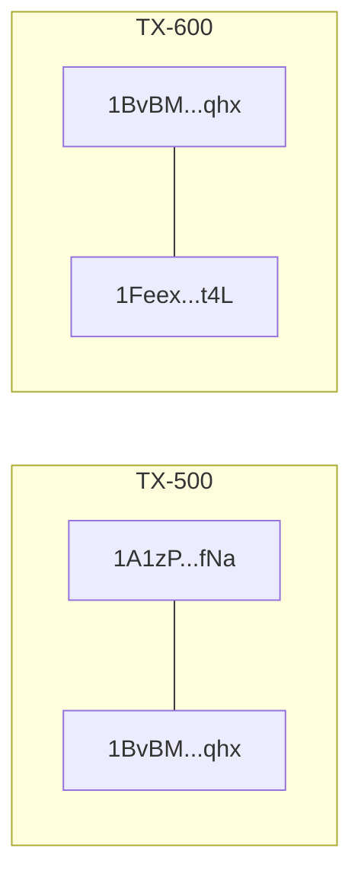
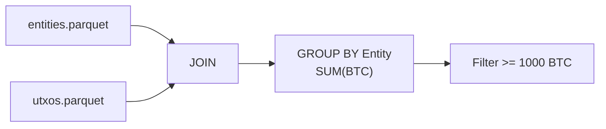
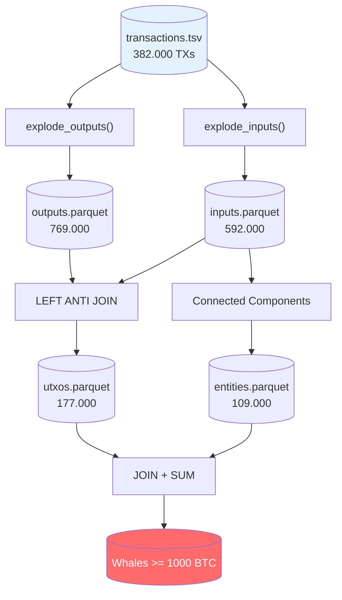

# Bitcoin Whale Intelligence - Daten-Pipeline

> Wie wir aus Rohdaten versteckte Bitcoin-Wale finden

## Warum nur transactions.tsv?

Blockchair liefert zwei Dateitypen:
- **blocks.tsv** - Nur Metadaten (Zeitstempel, Miner-Belohnung) - **NICHT BENOETIGT**
- **transactions.tsv** - Alle Transaktionen mit Inputs/Outputs - **DAS BRAUCHEN WIR**

---

## 1. Die Rohdaten verstehen

### Transaktion erklaert

```
INPUTS (Woher kommt das Geld?)
========================================
  spent_transaction_hash: "a1075d...8e3e"  <-- Verweis auf ALTE Transaktion
  spent_output_index: 0                    <-- Welcher Output davon
  address: "12cbQ...xV8s"                  <-- Wer unterschreibt (Private Key)

  --> "Ich gebe Output 0 aus Transaktion a1075d aus"

OUTPUTS (Wohin geht das Geld?)
========================================
  Output 0: 10.00 BTC an "1Q2TW...Wm8H"   <-- Empfaenger
  Output 1:  0.50 BTC an "12cbQ...xV8s"   <-- Wechselgeld zurueck
```

### Das JSON-Format (annotiert)

```json
{
  "hash": "f4184fc...b4c2",           // Eindeutige TX-ID
  "block_number": 170,                 // In welchem Block
  "inputs": [                          // QUELLE des Geldes
    {
      "spent_transaction_hash": "a1075d...8e3e",  // <-- Zeigt auf alten Output!
      "spent_output_index": 0,         // Welcher Output der alten TX
      "addresses": ["12cbQ...xV8s"]    // Wer signiert
    }
  ],
  "outputs": [                         // ZIEL des Geldes
    {
      "index": 0,
      "value": 1000000000,             // 10 BTC (in Satoshi)
      "addresses": ["1Q2TW...Wm8H"]    // Empfaenger
    }
  ]
}
```

**Einheit:** 100.000.000 Satoshi = 1 BTC

---

## 2. Schritt 1: Outputs extrahieren (explode)

**VORHER:** 1 Zeile mit Array

| tx_hash | outputs |
|---------|---------|
| f4184fc...b4c2 | [{idx:0, val:10BTC}, {idx:1, val:0.5BTC}] |

**NACHHER:** Mehrere Zeilen (flach)

| tx_hash | output_index | value | address |
|---------|--------------|-------|---------|
| f4184fc...b4c2 | 0 | 10 BTC | 1Q2TW...Wm8H |
| f4184fc...b4c2 | 1 | 0.5 BTC | 12cbQ...xV8s |

---

## 3. Schritt 2: Inputs extrahieren (explode)

**NACHHER:**

| tx_hash | spent_tx_hash | spent_output_index | address |
|---------|---------------|-------------------|---------|
| f4184fc...b4c2 | a1075d...8e3e | 0 | 12cbQ...xV8s |

---

## 4. Schritt 3: UTXO Set berechnen

### Was ist ein UTXO?

**UTXO = Unspent Transaction Output = Noch nicht ausgegebener Output**

Jeder Output ist wie ein Geldschein. Wenn du ihn ausgibst, existiert er nicht mehr.

### Schritt-fuer-Schritt Beispiel

**3 Outputs existieren:**

| tx_hash | output_index | value |
|---------|--------------|-------|
| TX-100 | 0 | 5 BTC |
| TX-100 | 1 | 3 BTC |
| TX-200 | 0 | 2 BTC |

**TX-300 gibt einen davon aus:**

| spent_tx_hash | spent_output_index |
|---------------|-------------------|
| TX-100 | 0 |

### LEFT ANTI JOIN visualisiert

```
ALLE OUTPUTS:                    SPENT-REFERENZEN:
+---------------+                +---------------+
| TX-100:0 5BTC | <-- Match! --> | TX-100:0      |  --> RAUS!
| TX-100:1 3BTC |                +---------------+
| TX-200:0 2BTC |
+---------------+

ERGEBNIS (UTXOs = was NICHT gematcht hat):
+---------------+
| TX-100:1 3BTC |  <-- Noch nicht ausgegeben
| TX-200:0 2BTC |  <-- Noch nicht ausgegeben
+---------------+
```

**Als SQL:**
```sql
SELECT * FROM outputs
WHERE (tx_hash, output_index) NOT IN (
    SELECT spent_tx_hash, spent_output_index FROM inputs
)
```

---

## 5. Schritt 4: Entity Clustering

### Die Kern-Idee

Wenn eine Transaktion **mehrere Inputs** hat, muessen alle vom **selben Besitzer** kommen - nur er hat alle Private Keys!

### Konkretes Beispiel

**TX-500 hat 2 Inputs:**
```
- 2 BTC von Adresse 1A1zP...fNa (braucht Private Key A)
- 3 BTC von Adresse 1BvBM...qhx (braucht Private Key B)
```

**Schlussfolgerung:** `1A1zP...fNa` und `1BvBM...qhx` = SELBER BESITZER!

### Graph aufbauen



### Connected Components findet Gruppen

| Adresse | Entity ID |
|---------|-----------|
| 1A1zP...fNa | 1 |
| 1BvBM...qhx | 1 |
| 1Feex...t4L | 1 |
| 3D2oe...mW9 | 2 |

A verbunden mit B, B verbunden mit C --> A, B, C = Entity 1

---

## 6. Schritt 5: Whale Detection



### Beispiel-Rechnung

**UTXOs:**

| address | value |
|---------|-------|
| 1A1zP...fNa | 500 BTC |
| 1BvBM...qhx | 300 BTC |
| 1Feex...t4L | 200 BTC |

**Entities:** Alle drei = Entity 1

**Nach JOIN + GROUP BY:**

| entity_id | adressen | total_btc |
|-----------|----------|-----------|
| 1 | 3 | **1000 BTC = WAL!** |

---

## 7. Die komplette Pipeline



---

## 8. Metriken (H1/2011 Testdaten)

| Schritt | Vorher | Nachher | Was passiert |
|---------|--------|---------|--------------|
| Laden | TSV | 382.000 TXs | Rohdaten einlesen |
| Outputs | 382k TXs | 769.000 | explode() |
| Inputs | 382k TXs | 592.000 | explode() |
| UTXOs | 769k | 177.000 | 77% wurden ausgegeben |
| Entities | 148.000 Adressen | 109.000 | 26% gruppiert |

**26% Reduktion:** Fast ein Viertel aller Adressen gehoeren zu Mehrfach-Besitzern!
