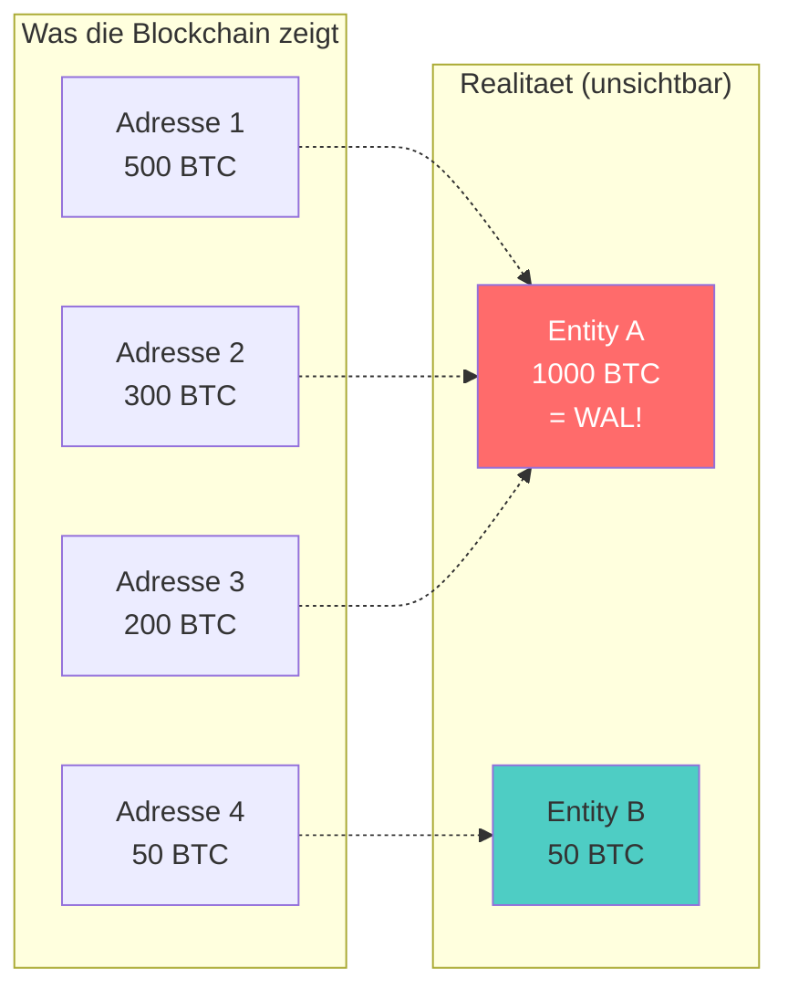
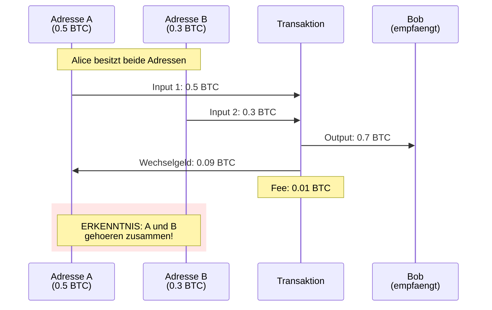
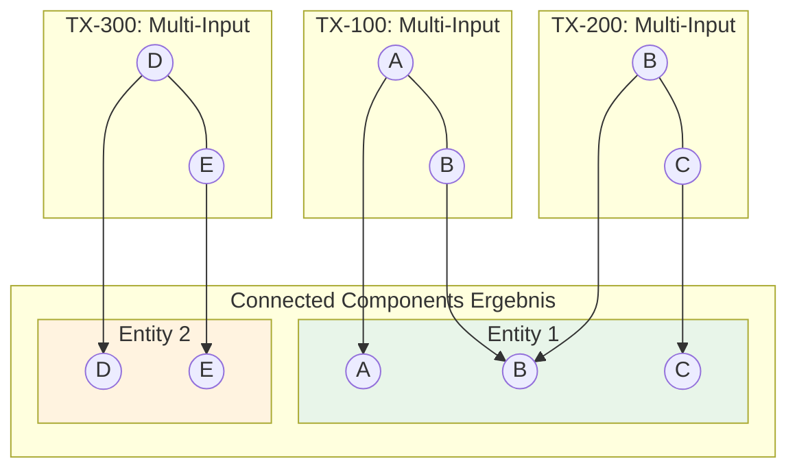
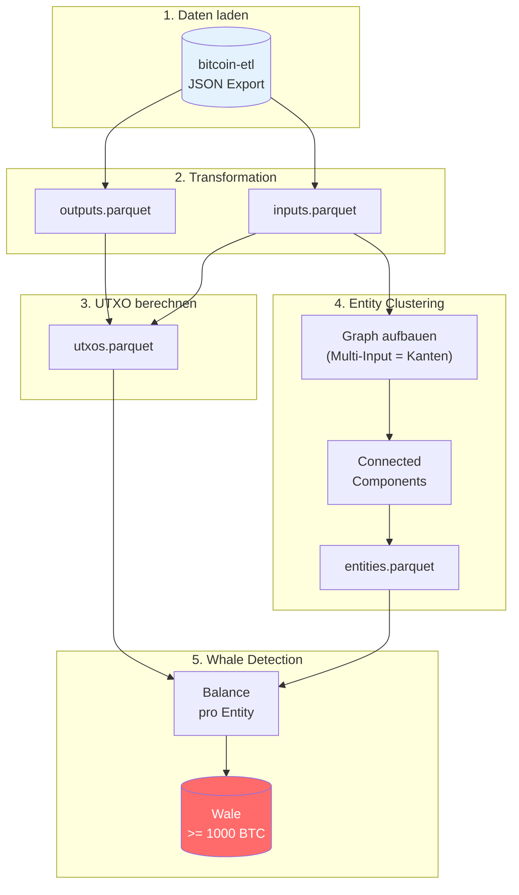
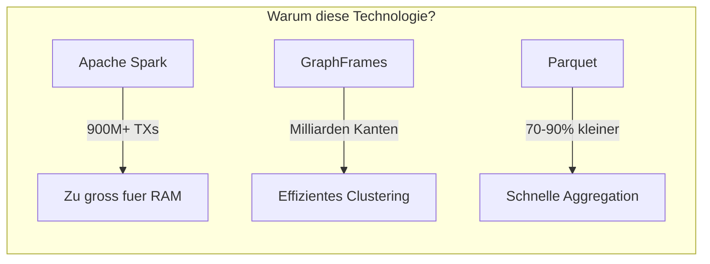

# Bitcoin Whale Intelligence - Architektur

> Wie wir versteckte Bitcoin-Wale finden

---

## Das Problem



**Das Problem:** Ein Wal kann sein Vermoegen auf hunderte Adressen verteilen. Ohne Clustering bleibt er unsichtbar.

---

## Die Loesung: Common Input Ownership

Wenn eine Transaktion mehrere Input-Adressen kombiniert, besitzt der Sender ALLE Private Keys:



**Warum das funktioniert:** Ohne alle Private Keys keine gueltige Signatur. Das Bitcoin-Protokoll erzwingt das.

---

## Entity Clustering als Graph

Multi-Input-Transaktionen bilden Kanten zwischen Adressen:



**Transitive Verknuepfung:** A-B und B-C bedeutet A-B-C gehoeren zusammen.

---

## Die Pipeline



| Schritt | Output | Warum noetig? |
|---------|--------|---------------|
| 1. Laden | tx_df | Brauchen alle Transaktionen |
| 2. Transform | outputs/inputs.parquet | Parquet 10x schneller als JSON |
| 3. UTXO | utxos.parquet | Nur unspent = aktueller Wert |
| 4. Clustering | entities.parquet | Adressen zu Entities gruppieren |
| 5. Detection | whale_entities.parquet | Endlich Wale sichtbar! |

---

## Tech Stack



| Technologie | Zweck | Alternative (funktioniert NICHT) |
|-------------|-------|----------------------------------|
| Apache Spark | Verteilte Verarbeitung | Pandas (max 10M Zeilen) |
| GraphFrames | Connected Components | NetworkX (Single-Node) |
| Parquet | Spalten-Storage | CSV (keine Kompression) |

---

## Datenmodell

### entities.parquet
```
address         | entity_id
----------------|----------
1ABC...         | 42
1DEF...         | 42        <- Gleiche Entity
1GHI...         | 42        <- Gleiche Entity
1XYZ...         | 99        <- Andere Entity
```

### Whale Detection (Schritt 5)
```sql
SELECT entity_id,
       COUNT(address) as address_count,
       SUM(utxo.value) / 100000000 as balance_btc
FROM entities
JOIN utxos ON entities.address = utxos.address
GROUP BY entity_id
HAVING balance_btc >= 1000
```

---

## Projekt-Status

| Notebook | Status | Beschreibung |
|----------|--------|--------------|
| 01_entity_clustering | Fertig | Daten laden, UTXO, Clustering |
| 02_whale_detection | Geplant | Balance pro Entity |
| 03_behavior_analysis | Geplant | Akkumulation vs Distribution |

---

## Metriken (Testdaten H1/2011)

| Metrik | Wert |
|--------|------|
| Transaktionen | 382.000 |
| Outputs | 769.000 |
| Adressen im Graph | 147.907 |
| Entities | 109.000 |
| Reduktion | 26% |

Die 26% Reduktion zeigt: Viele Adressen konnten gruppiert werden. Bei neueren Daten (2015+) steigt die Rate auf 40-60%.
