# Bitcoin Whale Intelligence - Pipeline Diagramme

---

## Das Problem

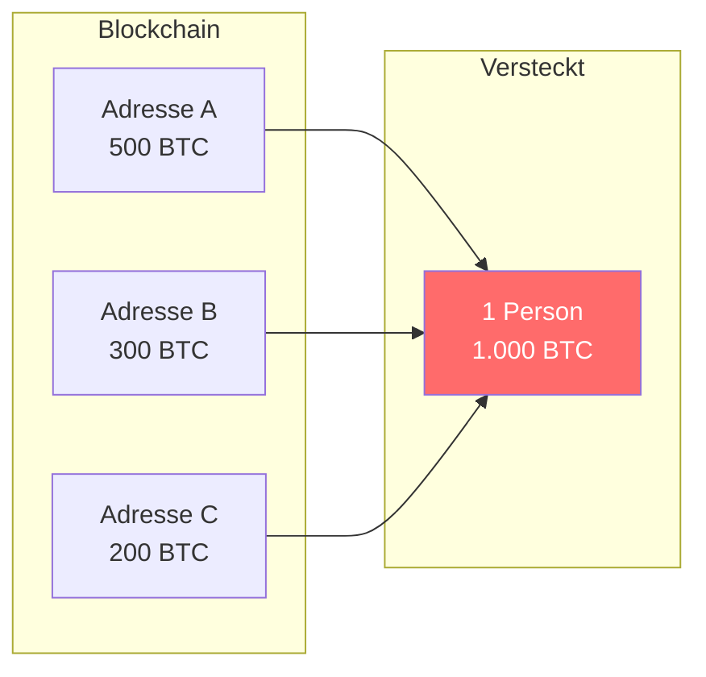

---

## Bitcoin: UTXO-Modell

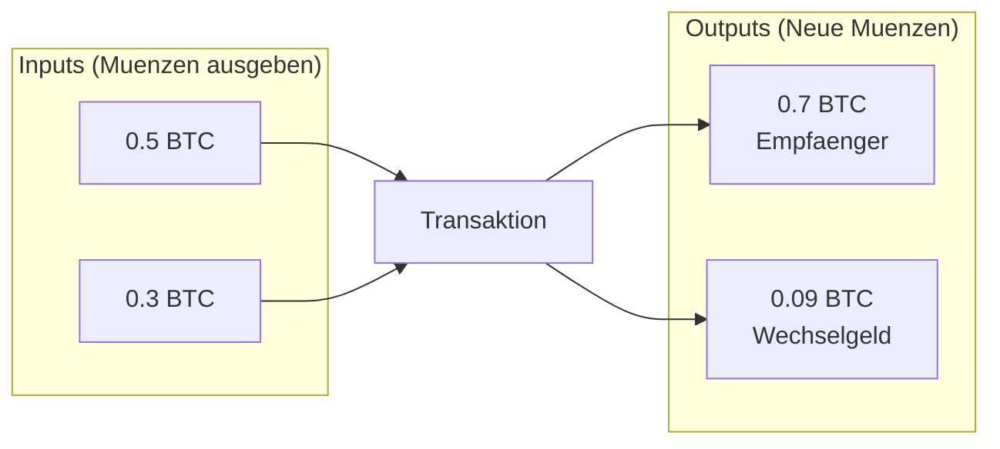

---

## Private Key = Besitzbeweis

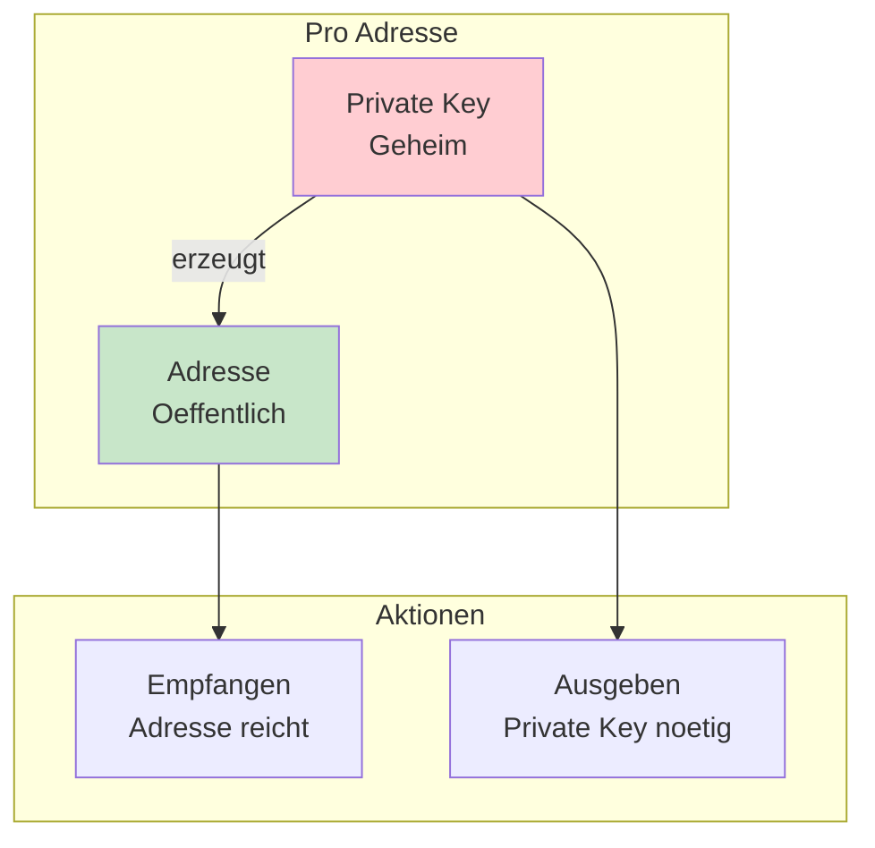

---

## Common Input Ownership Heuristic

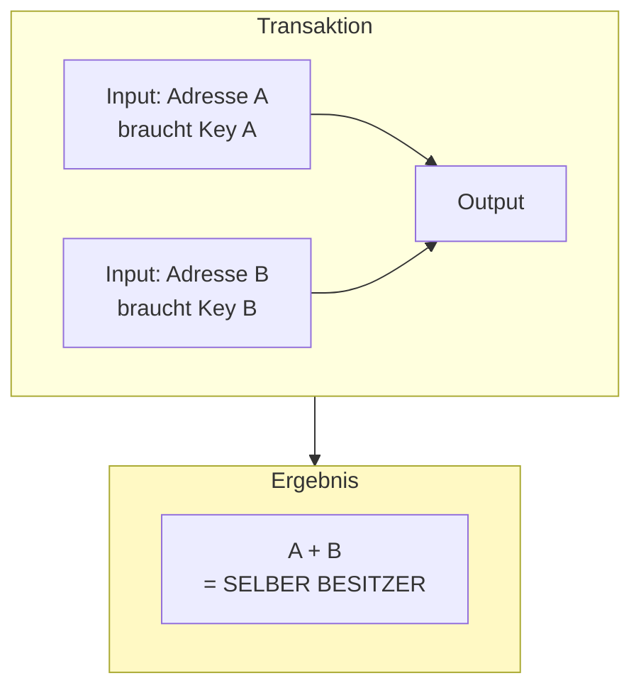

---

## Inputs vs Outputs

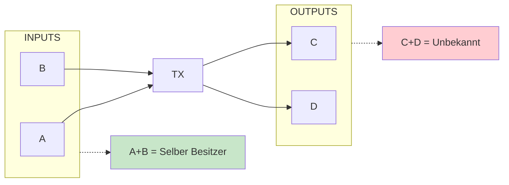

---

## Datenquelle

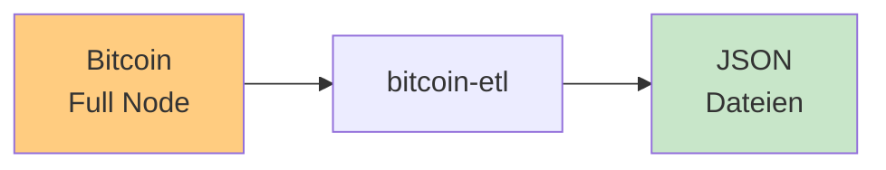

---

## Pipeline Gesamtuebersicht

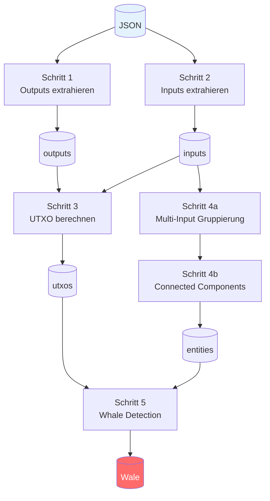

---

## Schritt 1: Outputs extrahieren

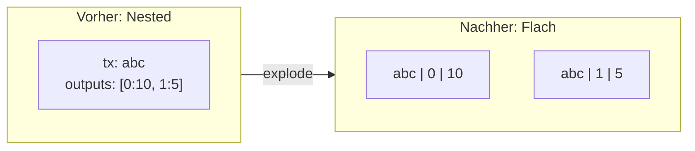

---

## Schritt 2: Inputs extrahieren

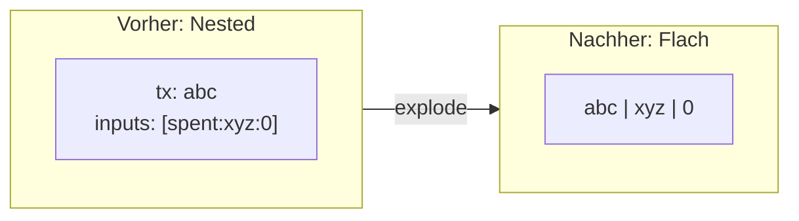

---

## Schritt 3: UTXO berechnen

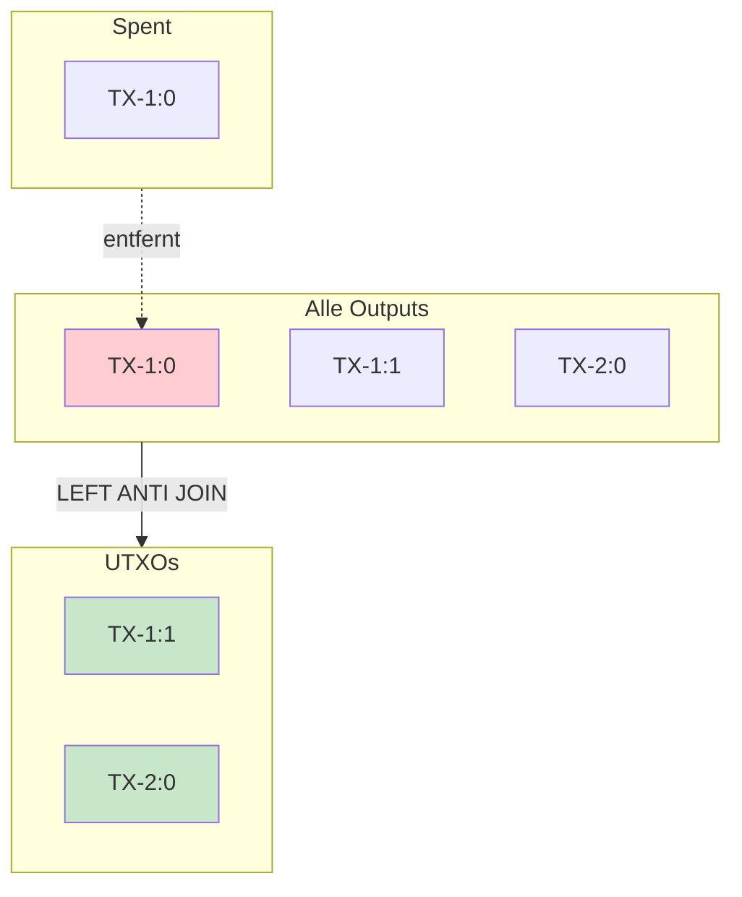

---

## Schritt 4a: Multi-Input Gruppierung

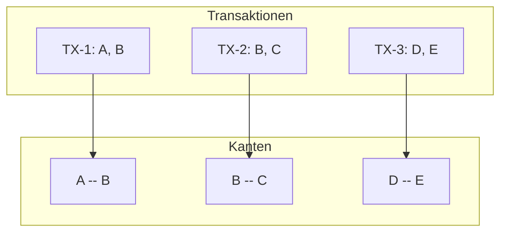

---

## Schritt 4b: Connected Components

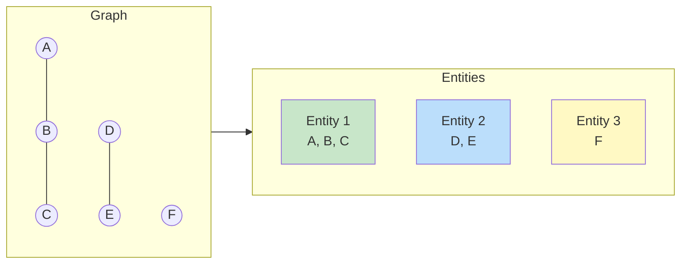

---

## Transitive Verknuepfung

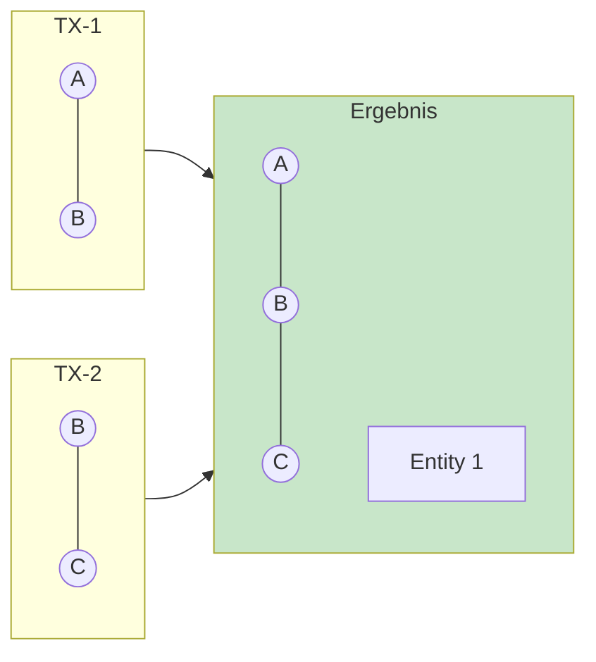

---

## Schritt 5: Whale Detection

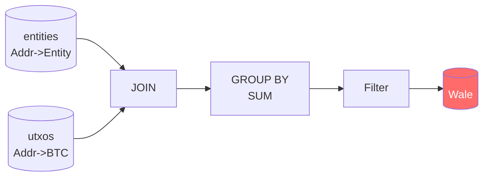

---

## Whale Beispiel

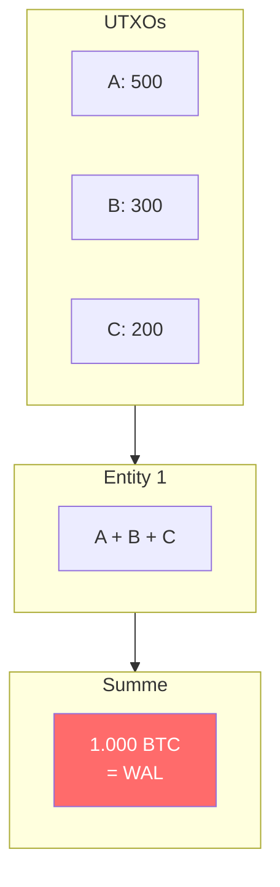

---

## Tech Stack

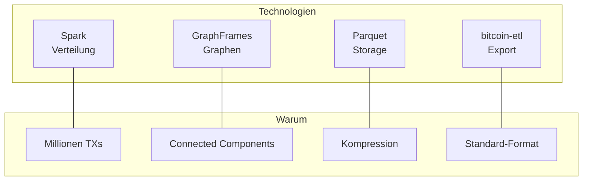

---

## Zusammenfassung

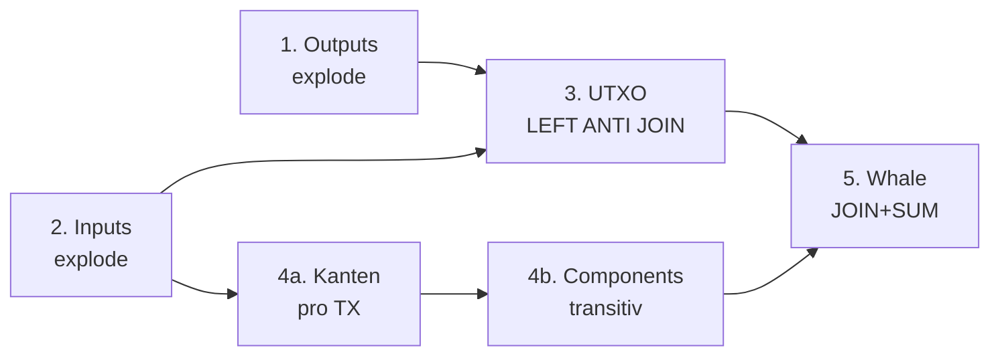
